# Sổ tay Solution Architect

Tài liệu này viết cho dev muốn hiểu SA làm gì, hoặc dev đang chuyển sang làm SA.

---

## 1) SA là gì

SA (Solution Architect) là người chịu trách nhiệm cho câu hỏi: **"Hệ thống này được xây như thế nào để chạy được trên production?"**

SA không code, nhưng mọi bug liên quan đến architecture đều là lỗi của SA:
- Service A gọi service B timeout → SA đã không define timeout và retry policy
- Database bị lock → SA đã không tính đến concurrent writes
- Release xong thì chết → SA đã không có rollback plan
- Bill cloud tăng 10x → SA đã không tính cost khi scale

**SA khác gì Tech Lead?**

| | SA | Tech Lead |
|---|---|---|
| Quyết định | Hệ thống gồm những gì, deploy ở đâu | Code bên trong mỗi service viết như thế nào |
| Scope | Cross-team, cross-service | Trong 1 team, 1-2 services |
| Output | Diagrams, specs, Architecture Decision Records (Bản ghi quyết định kiến trúc) | Code, PRs, code reviews |
| Fail khi | Production chết vì architecture | Sprint delay vì code quality |

---

## 2) 6 góc nhìn khi thiết kế (Quality Attributes)

Mỗi quyết định của SA đều phải cân nhắc 6 góc:

### 2.1 Operability (Vận hành)

**Câu hỏi:** "Khi 3h sáng có alert, on-call có debug được không?"

**Kiểm tra:**
- [ ] Log có đủ context (request_id, user_id, timestamp)?
- [ ] Có dashboard để nhìn health?
- [ ] Có runbook để follow?
- [ ] Có thể restart service mà không mất data?

**Anti-pattern:** Log chỉ có `Error occurred` không có stack trace, không có request context → debug mất 2 tiếng.

### 2.2 Security (Bảo mật)

**Câu hỏi:** "Nếu attacker có access vào server này, họ lấy được gì?"

**Kiểm tra:**
- [ ] Secrets có trong env var plain text không? → Phải dùng Vault/Secrets Manager
- [ ] Application Programming Interface (Giao diện lập trình ứng dụng) có auth không? Token có expire không?
- [ ] Data nhạy cảm (Personally Identifiable Information - Thông tin nhận dạng cá nhân, payment) có encrypt không?
- [ ] Có audit log ai làm gì không?

**Chuyện thật:** Một team commit `.env` file vào git, bị bot scan GitHub và hack AWS account trong 15 phút, bill $50k.

### 2.3 Reliability (Tin cậy)

**Câu hỏi:** "Khi component X chết, user thấy gì?"

**Kiểm tra:**
- [ ] Có circuit breaker không? Khi downstream chết thì không cascade failure
- [ ] Có retry với exponential backoff không?
- [ ] Có timeout cho mọi external call không?
- [ ] Database có replica không? Replica lag bao nhiêu?

**Ví dụ Circuit Breaker Pattern:**

```go
// Không có circuit breaker - cascade failure
func GetUser(id string) (*User, error) {
    return userService.Get(id) // Nếu userService chết → tất cả request đều timeout
}

// Có circuit breaker
func GetUser(id string) (*User, error) {
    result, err := circuitBreaker.Execute(func() (interface{}, error) {
        return userService.Get(id)
    })
    if err == circuit.ErrOpenState {
        return getCachedUser(id) // Fallback to cache
    }
    return result.(*User), err
}
```

### 2.4 Performance (Hiệu năng)

**Câu hỏi:** "Latency P99 là bao nhiêu? Throughput max là bao nhiêu?"

**Lưu ý:** P99 quan trọng hơn P50. Nếu P50 = 50ms nhưng P99 = 5s nghĩa là 1% user chờ 5 giây.

**Bottleneck thường gặp:**
1. **N+1 query:** Fetch 100 orders → 100 queries để lấy user của mỗi order
2. **No index:** Query trên column không có index
3. **No cache:** Mỗi request đều query DB cho data ít thay đổi
4. **Sync call khi có thể async:** Gửi email sync trong API request

**Ví dụ fix N+1:**

```sql
-- Bad: N+1 queries
SELECT * FROM orders WHERE user_id = 1;
SELECT * FROM users WHERE id = 1; -- repeated N times

-- Good: JOIN hoặc batch
SELECT o.*, u.name
FROM orders o
JOIN users u ON o.user_id = u.id
WHERE o.user_id = 1;
```

### 2.5 Cost (Chi phí)

**Câu hỏi:** "Khi traffic tăng 10x, bill tăng bao nhiêu?"

**Bẫy chi phí:**
- Network Address Translation Gateway (Cổng dịch NAT): $0.045/GB data processed → traffic nội bộ nhiều thì tốn
- Data transfer cross-Availability Zone (Vùng khả dụng): $0.01/GB
- Relational Database Service (Dịch vụ cơ sở dữ liệu quan hệ) Multi-Availability Zone: x2 cost
- AWS Lambda (Dịch vụ tính toán không máy chủ): rẻ khi traffic thấp, đắt khi traffic cao liên tục

**Ví dụ tính cost:**

```
Scenario: 1M requests/day, mỗi request 100KB response

Phương án A: Elastic Compute Cloud (Điện toán đám mây đàn hồi) t3.medium
- Instance: $30/month
- Application Load Balancer (Cân bằng tải ứng dụng): $20/month
- Total: ~$50/month

Phương án B: AWS Lambda + Application Programming Interface Gateway (Cổng giao diện lập trình ứng dụng)
- AWS Lambda: 1M * $0.0000002 = $0.2/month
- Application Programming Interface Gateway: 1M * $3.5/million = $3.5/month
- Data transfer: 100GB * $0.09 = $9/month
- Total: ~$13/month

→ AWS Lambda rẻ hơn cho traffic này
→ Nhưng nếu 100M requests/day, AWS Lambda = $1300/month, Elastic Compute Cloud vẫn ~$50
```

### 2.6 Sustainability (Bền vững)

**Câu hỏi:** "Có resource nào chạy mà không ai dùng không?"

**Kiểm tra:**
- [ ] Có dev/staging instances chạy 24/7 mà chỉ dùng 8h/ngày?
- [ ] Có log retention quá dài (giữ 1 năm trong khi chỉ cần 30 ngày)?
- [ ] Có over-provisioned instances (CPU usage < 10%)?

---

## 3) Roles trong team

### 3.1 SA quyết định gì

| Quyết định | Ví dụ |
|------------|-------|
| Service boundaries | "Order Service và Payment Service tách riêng" |
| Communication patterns | "Dùng REST cho sync, Apache Kafka cho async" |
| Data storage | "PostgreSQL cho transactional, Redis cho cache, Simple Storage Service (Dịch vụ lưu trữ đơn giản) cho files" |
| Deployment topology | "3 Availability Zones (Vùng khả dụng), 2 replicas mỗi service" |
| Security boundaries | "Payment service trong private subnet, chỉ internal Application Load Balancer access" |

### 3.2 Tech Lead quyết định gì

| Quyết định | Ví dụ |
|------------|-------|
| Code structure | "Dùng Clean Architecture" |
| Testing strategy | "Unit test coverage 80%, integration test cho happy path" |
| Code conventions | "Dùng gofmt, eslint với airbnb config" |
| Sprint execution | "Chia task, assign, review PRs" |

### 3.3 Khi team không có SA

Tech Lead phải gánh thêm:
- Vẽ architecture diagrams
- Viết ADRs
- Coordinate với DevOps về deployment
- Review NFRs với stakeholders

**Lưu ý:** Tech Lead làm SA thường thiếu góc nhìn cross-team và operations. Cần involve DevOps/SRE sớm.

### 3.4 Tech Lead → SA Transition Guide

**Thay đổi tư duy:**

| Tech Lead Mindset | SA Mindset |
|-------------------|------------|
| "Code này clean chưa?" | "System này chạy được production chưa?" |
| "Sprint này ship được không?" | "6 tháng sau system này có scale được không?" |
| "Team mình làm xong chưa?" | "Tất cả teams integrate được chưa?" |
| "Feature này implement sao?" | "Feature này ảnh hưởng gì đến system?" |

**Kỹ năng cần phát triển:**

| Kỹ năng | Tech Lead có | SA cần thêm |
|-------|-------------|-------------|
| Code review | ✅ | System design review |
| Team management | ✅ | Cross-team coordination |
| Sprint planning | ✅ | Roadmap planning |
| Debugging | ✅ | Tìm nguyên nhân ở system level |
| Application Programming Interface design | ✅ | Integration patterns |
| Database schema | ✅ | Data architecture |
| Local testing | ✅ | Production testing |

**Cụ thể phải học:**

| Tuần | Trọng tâm | Sản phẩm |
|------|-------|-------------|
| 1-2 | Non-Functional Requirements (Yêu cầu phi chức năng) | Viết Non-Functional Requirements spec cho project hiện tại |
| 3-4 | Diagrams | Vẽ Context + Component diagram |
| 5-6 | ADRs | Viết 3 ADRs cho decisions gần đây |
| 7-8 | Observability | Setup dashboard + alerts |
| 9-10 | Security | Security review checklist |
| 11-12 | Release | Design release strategy |

**Thói quen hàng ngày thay đổi:**

| Trước (Tech Lead) | Sau (SA) |
|-------------------|----------|
| Code review 2h/ngày | System review 2h/ngày |
| 1:1 với team | 1:1 với các Tech Leads |
| Debug trong IDE | Debug trong logs/metrics |
| Read code | Read architecture docs |
| Write code | Write specs + ADRs |

**Khi nào ready cho SA role?**

- [ ] Có thể vẽ system diagram trong 10 phút
- [ ] Hiểu production metrics của system
- [ ] Biết failure modes của mỗi component
- [ ] Có thể estimate infra cost
- [ ] Có thể explain decisions cho non-tech stakeholders
- [ ] Đã handle ít nhất 1 production incident

---

## 4) Problems SA giải quyết

### 4.1 Integration Hell

**Triệu chứng:** FE và BE code xong, tích hợp thì không chạy.

**Nguyên nhân:** Không có Application Programming Interface spec rõ ràng trước khi code.

**Giải pháp:**
1. Viết OpenAPI spec trước
2. FE/BE review và sign-off
3. Generate mock server từ spec để FE dev song song
4. BE implement theo spec
5. Contract test để ensure BE match spec

**Ví dụ Contract Test:**

```javascript
// contract.test.js
const spec = require('./openapi.json');
const api = require('./api');

describe('POST /orders', () => {
  it('should match OpenAPI spec', async () => {
    const response = await api.post('/orders', {
      user_id: 'user-123',
      items: [{ product_id: 'prod-1', quantity: 2 }]
    });

    // Validate response against spec
    expect(response.status).toBe(201);
    expect(validateAgainstSpec(response.body, spec.paths['/orders'].post.responses['201'])).toBe(true);
  });
});
```

### 4.2 Deployment Fear

**Triệu chứng:** Team sợ deploy vì hay bị incident.

**Nguyên nhân:** Không có rollback plan, không có canary, không có health checks.

**Giải pháp:**

```yaml
# Kubernetes deployment với rollback
apiVersion: apps/v1
kind: Deployment
spec:
  strategy:
    type: RollingUpdate
    rollingUpdate:
      maxSurge: 1
      maxUnavailable: 0
  template:
    spec:
      containers:
      - name: app
        livenessProbe:
          httpGet:
            path: /health
            port: 8080
          initialDelaySeconds: 10
          periodSeconds: 5
        readinessProbe:
          httpGet:
            path: /ready
            port: 8080
          initialDelaySeconds: 5
          periodSeconds: 3
```

```bash
# Rollback command
kubectl rollout undo deployment/my-app
```

### 4.3 Database Migration Disasters

**Triệu chứng:** Chạy migration xong, production chết 2 tiếng.

**Nguyên nhân:**
- Migration lock table quá lâu
- Không test với production-size data
- Không có rollback plan

**Giải pháp - Expand/Contract Pattern:**

```sql
-- Phase 1: Expand (backward compatible)
ALTER TABLE users ADD COLUMN email_new VARCHAR(255);

-- Phase 2: Migrate data (background job)
UPDATE users SET email_new = email WHERE email_new IS NULL;

-- Phase 3: Switch code to use email_new
-- Deploy code that reads/writes email_new

-- Phase 4: Contract (after all code deployed)
ALTER TABLE users DROP COLUMN email;
ALTER TABLE users RENAME COLUMN email_new TO email;
```

### 4.4 Observability Gaps

**Triệu chứng:** Alert "Error rate high" nhưng không biết error ở đâu.

**Nguyên nhân:** Log không có correlation, không có tracing.

**Giải pháp - Structured logging với trace ID:**

```go
// Middleware để inject trace ID
func TracingMiddleware(next http.Handler) http.Handler {
    return http.HandlerFunc(func(w http.ResponseWriter, r *http.Request) {
        traceID := r.Header.Get("X-Trace-ID")
        if traceID == "" {
            traceID = uuid.New().String()
        }
        ctx := context.WithValue(r.Context(), "trace_id", traceID)

        // Log với trace ID
        log.Info().
            Str("trace_id", traceID).
            Str("method", r.Method).
            Str("path", r.URL.Path).
            Msg("Request started")

        next.ServeHTTP(w, r.WithContext(ctx))
    })
}
```

### 4.5 Cost Explosion

**Triệu chứng:** AWS bill tháng này tăng 300% không rõ lý do.

**Nguyên nhân:**
- Không set budget alerts
- Không tag resources
- Không review cost weekly

**Giải pháp:**

```terraform
# Tagging strategy
resource "aws_instance" "app" {
  tags = {
    Environment = "production"
    Team        = "order-team"
    Service     = "order-service"
    CostCenter  = "engineering"
  }
}

# Budget alert
resource "aws_budgets_budget" "monthly" {
  name         = "monthly-budget"
  budget_type  = "COST"
  limit_amount = "10000"
  limit_unit   = "USD"
  time_unit    = "MONTHLY"

  notification {
    comparison_operator = "GREATER_THAN"
    threshold           = 80
    threshold_type      = "PERCENTAGE"
    notification_type   = "ACTUAL"
    subscriber_email_addresses = ["team@company.com"]
  }
}
```

---

## 5) SA Playbook: 12 bước từ Day 0 đến Production

**Bài toán xuyên suốt:** Startup muốn build E-Commerce Platform cho phép users mua hàng, thanh toán, track đơn hàng. Team có 5 BE + 3 FE + 1 DevOps, timeline 3 tháng, budget $50k/tháng. SA phải giải quyết từ Day 0 đến khi chạy production.

> Mỗi bước dưới đây đều dùng bài toán này làm ví dụ. SA đi từng bước, output của bước trước là input của bước sau.

---

### Bước 1 — Document Scope & Constraints

**Tại sao quan trọng:** Không có scope rõ thì team sẽ build sai thứ hoặc build quá nhiều.

**Tài liệu Scope:**

| Mục | Nội dung |
|---------|---------|
| **Project** | E-Commerce Platform |
| **Mục tiêu** | Users mua hàng online, thanh toán, track đơn hàng |
| **Chỉ số thành công** | 10,000 orders/ngày, Conversion > 2%, Cart abandonment < 70% |

**Constraints:**

| Loại | Ràng buộc | Lý do |
|------|------------|--------|
| Timeline | MVP trong 3 tháng | Contract với investor |
| Budget | $50k/tháng infra | Runway 18 tháng |
| Tech | Phải dùng AWS | Hợp đồng có sẵn |
| Tech | Phải dùng Go | Team quen |
| Compliance | Payment Card Industry Data Security Standard (Tiêu chuẩn bảo mật dữ liệu ngành thẻ thanh toán) | Payment processing |
| Team | 5 BE, 3 FE, 1 DevOps | Headcount hiện tại |

**Ngoài phạm vi (Minimum Viable Product - Sản phẩm khả thi tối thiểu):** Multi-language, Mobile app (web responsive only), Marketplace (only own products)

**Xong khi:** PO sign-off

---

### Bước 2 — Define NFRs (Yêu cầu phi chức năng) với số cụ thể

**Tại sao quan trọng:** Không có số thì không biết design đủ hay chưa.

**Non-Functional Requirements (Yêu cầu phi chức năng) Specification cho E-Commerce:**

**Performance:**

| Chỉ số | Mục tiêu | Cách đo |
|--------|--------|-------------|
| Application Programming Interface Latency P50 | < 100ms | Datadog Application Performance Monitoring |
| Application Programming Interface Latency P99 | < 500ms | Datadog Application Performance Monitoring |
| Page Load Time | < 3s | Lighthouse |
| Throughput | 500 req/s | Load test |

**Reliability:**

| Chỉ số | Mục tiêu | Cách đo |
|--------|--------|-------------|
| Availability | 99.9% | Uptime monitor |
| Recovery Time Objective (Mục tiêu thời gian phục hồi) | 1 giờ | Disaster Recovery drill |
| Recovery Point Objective (Mục tiêu điểm phục hồi) | 5 phút | Backup test |
| Error Rate | < 0.1% | Error tracking |

**Scalability:**

| Chỉ số | Mục tiêu |
|--------|--------|
| Concurrent Users | 10,000 |
| Data Volume | 1TB/năm |
| Traffic Spike | Xử lý 5x bình thường |

**Security:**

| Yêu cầu | Cách triển khai |
|-------------|----------------|
| Authentication | JSON Web Token (Token web JSON) + refresh token |
| Authorization | Role-Based Access Control (Kiểm soát truy cập dựa trên vai trò) |
| Encryption | TLS 1.3, AES-256 at rest |
| Secrets | AWS Secrets Manager |

**Cost:** Monthly < $50k, Cost per order < $0.10

**Xong khi:** Stakeholders sign-off, mỗi dòng có số

---

### Bước 3 — Vẽ Context Diagram

**Tại sao quan trọng:** Hiểu boundary của system và integration points.

**Ví dụ:**

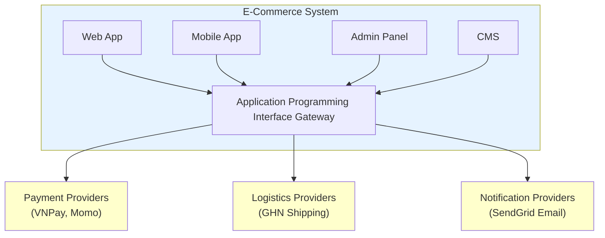

**Kiểm tra:**
- [ ] Tất cả user types đã list?
- [ ] Tất cả external systems đã list?
- [ ] Data flow direction đã clear?

---

### Bước 4 — Vẽ Component Diagram

**Tại sao quan trọng:** Define service boundaries và ownership.

**Ví dụ:**

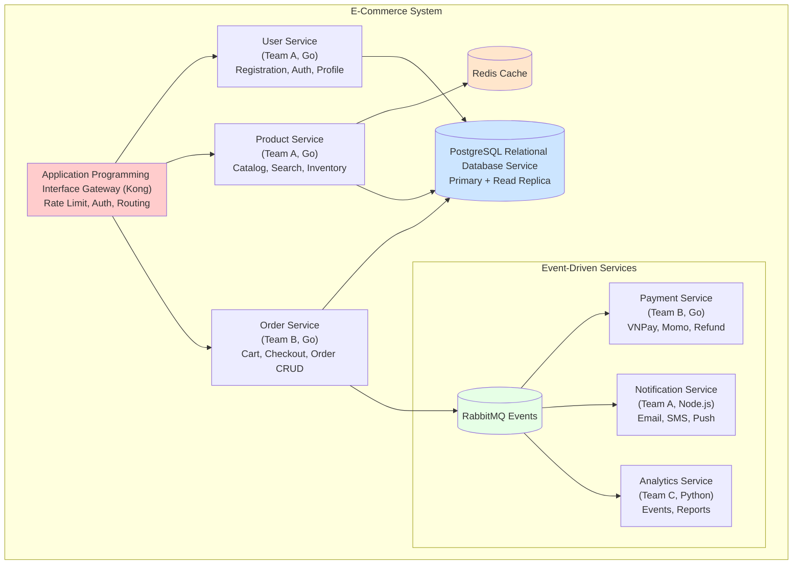

**Bảng phân công:**

| Service | Team | Công nghệ | Repo | On-call |
|---------|------|------|------|---------|
| Application Programming Interface Gateway | DevOps | Kong | infra/kong | devops-oncall |
| User Service | Team A | Go | services/user | team-a-oncall |
| Product Service | Team A | Go | services/product | team-a-oncall |
| Order Service | Team B | Go | services/order | team-b-oncall |
| Payment Service | Team B | Go | services/payment | team-b-oncall |
| Notification | Team A | Node | services/notification | team-a-oncall |
| Analytics | Team C | Python | services/analytics | team-c-oncall |

**Xong khi:** Mỗi box có owner và on-call rotation

---

### Bước 5 — Compare Architecture Options

**Tại sao quan trọng:** Justify why this architecture, not another.

**Ví dụ Decision Matrix:**

**Bối cảnh:**
Cần chọn architecture cho e-commerce platform mới.
Team: 5 BE devs, kinh nghiệm microservices.
Timeline: Minimum Viable Product (Sản phẩm khả thi tối thiểu) 3 tháng.

**Phương án A: Modular Monolith**

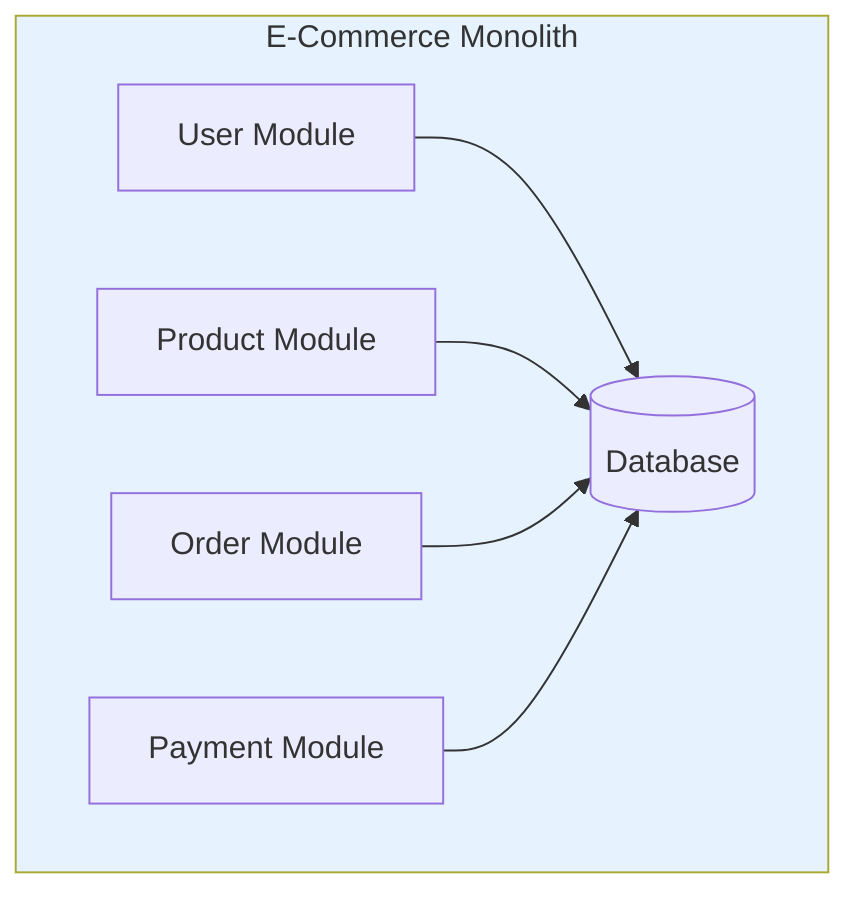

**Phương án B: Microservices** (Diagram như bước 4)

**Phương án C: Serverless**

```mermaid
flowchart LR
    APIGW[Application Programming Interface Gateway] --> Lambda[AWS Lambda Functions]
    Lambda --> DynamoDB[(DynamoDB)]
    Lambda --> Simple Queue Service[Simple Queue Service Queue]
    Simple Queue Service --> Lambda2[Lambda Workers]
    Lambda2 --> External[External APIs]
    style APIGW fill:#ff9900
    style Lambda fill:#ff9900
    style DynamoDB fill:#3b48cc
```

**Ma trận so sánh:**

| Tiêu chí | Trọng số | Monolith | Microservices | Serverless |
|----------|--------|----------|---------------|------------|
| Time to Minimum Viable Product | 25% | 9 | 6 | 7 |
| Scalability | 20% | 5 | 9 | 9 |
| Team quen thuộc | 20% | 7 | 9 | 5 |
| Độ phức tạp vận hành | 15% | 9 | 5 | 7 |
| Chi phí ở scale hiện tại | 10% | 8 | 6 | 9 |
| Chi phí ở 10x scale | 10% | 6 | 7 | 4 |
| **Điểm có trọng số** | | **7.3** | **7.1** | **6.8** |

**Quyết định:** Chọn **Microservices** vì:
1. Team đã có kinh nghiệm microservices
2. Payment service cần isolate vì Payment Card Industry Data Security Standard (Tiêu chuẩn bảo mật dữ liệu ngành thẻ thanh toán)
3. Expect scale khác nhau (Product reads >> Order writes)

**Hậu quả:**
| Loại | Ảnh hưởng |
|------|--------|
| Tốt | Independent scaling, team autonomy, fault isolation |
| Xấu | Network latency, distributed transactions complexity |
| Giảm thiểu | Start với 4 services, split thêm khi cần |

---

### Bước 6 — Write ADRs

**Tại sao quan trọng:** 6 tháng sau không ai nhớ tại sao chọn PostgreSQL.

**Architecture Decision Record (Bản ghi quyết định kiến trúc) Template (dùng cho E-Commerce project):**

| Mục | Nội dung |
|---------|---------|
| **Tiêu đề** | Architecture Decision Record-001: Use PostgreSQL as Primary Database |
| **Trạng thái** | Accepted |
| **Ngày** | 2024-01-15 |
| **Bối cảnh** | Cần database cho e-commerce: ACID cho orders/payments, complex queries, JSON cho product attributes |
| **Lựa chọn** | PostgreSQL, MySQL, MongoDB, DynamoDB |
| **Quyết định** | PostgreSQL 15 on AWS Relational Database Service |
| **Lý do** | ACID > MongoDB, JSONB tốt, 4/5 devs quen, Relational Database Service managed, ~$200/month |

**Hậu quả:**

| Loại | Chi tiết |
|------|--------|
| ✅ Tích cực | Strong consistency, rich queries, mature tooling, team quen |
| ❌ Tiêu cực | Horizontal scaling khó hơn, schema migration cần cẩn thận |
| ⚠️ Rủi ro | Write bottleneck → Read replicas + caching |
| ⚠️ Rủi ro | Migration downtime → Expand/contract pattern |

**Architecture Decision Record Folder Structure:**

| File | Mục đích |
|------|---------|
| docs/adr/001-use-postgresql.md | Chọn database |
| docs/adr/002-use-redis-for-caching.md | Chiến lược caching |
| docs/adr/003-use-rabbitmq-for-async.md | Message queue |
| docs/adr/004-use-kong-api-gateway.md | Application Programming Interface Gateway |
| docs/adr/template.md | Architecture Decision Record template |

---

### Bước 7 — Thiết kế Application Programming Interface

**Tại sao quan trọng:** FE và BE code song song mà không conflict.

**Application Programming Interface Endpoints:**

| Phương thức | Endpoint | Mô tả | Auth |
|--------|----------|-------|------|
| POST | /orders | Tạo đơn hàng mới | Bearer JSON Web Token |
| GET | /orders/{order_id} | Lấy chi tiết đơn hàng | Bearer JSON Web Token |
| PUT | /orders/{order_id}/status | Cập nhật trạng thái | Bearer JSON Web Token |
| DELETE | /orders/{order_id} | Hủy đơn hàng | Bearer JSON Web Token |

**POST /orders - Request:**

| Field | Kiểu | Bắt buộc | Mô tả |
|-------|------|----------|-------|
| items | array | ✅ | Danh sách sản phẩm |
| items[].product_id | string | ✅ | ID sản phẩm |
| items[].quantity | integer | ✅ | Số lượng (min: 1) |
| shipping_address | object | ✅ | Địa chỉ giao hàng |
| shipping_address.street | string | ✅ | Địa chỉ |
| shipping_address.city | string | ✅ | Thành phố |
| shipping_address.postal_code | string | ❌ | Mã bưu điện |
| payment_method | enum | ✅ | vnpay, momo, cod |

**POST /orders - Response (201):**

| Field | Kiểu | Mô tả |
|-------|------|-------|
| id | string | ID đơn hàng (format: ord_xxx) |
| status | enum | pending, paid, shipped, delivered, cancelled |
| items | array | Danh sách sản phẩm đã đặt |
| total | decimal | Tổng tiền |
| created_at | datetime | Thời gian tạo |

**Định dạng lỗi trả về:**

| Field | Kiểu | Mô tả |
|-------|------|-------|
| error.code | string | Mã lỗi (VD: ORDER_NOT_FOUND) |
| error.message | string | Mô tả lỗi |
| error.details | object | Chi tiết lỗi (tùy chọn) |

**Quy ước mã lỗi:**

| HTTP Status | Mẫu Error Code | Ví dụ |
|-------------|-------------------|---------|
| 400 | INVALID_* | INVALID_QUANTITY |
| 400 | MISSING_* | MISSING_FIELD |
| 401 | UNAUTHORIZED | UNAUTHORIZED |
| 403 | FORBIDDEN_* | FORBIDDEN_RESOURCE |
| 404 | *_NOT_FOUND | ORDER_NOT_FOUND |
| 409 | *_ALREADY_EXISTS | ORDER_ALREADY_EXISTS |
| 422 | *_FAILED | PAYMENT_FAILED |
| 500 | INTERNAL_ERROR | INTERNAL_ERROR |

---

### Bước 8 — Design Database Schema

**Tại sao quan trọng:** Schema sai thì migrate đau.

**Entity Relationship Diagram (Sơ đồ quan hệ thực thể):**

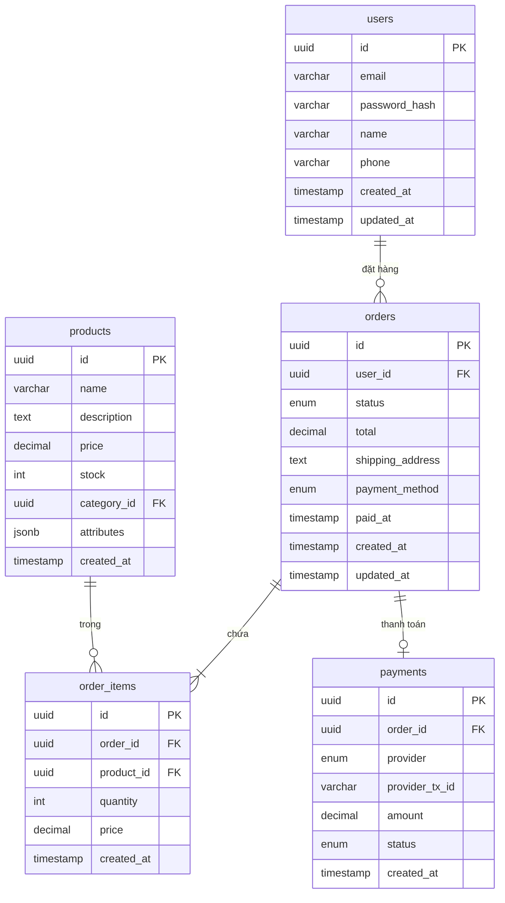

**Chiến lược Index:**

```sql
-- Users
CREATE INDEX idx_users_email ON users(email);

-- Products
CREATE INDEX idx_products_category ON products(category_id);
CREATE INDEX idx_products_name_search ON products USING gin(to_tsvector('english', name));

-- Orders
CREATE INDEX idx_orders_user_id ON orders(user_id);
CREATE INDEX idx_orders_status ON orders(status);
CREATE INDEX idx_orders_created_at ON orders(created_at DESC);

-- Order Items
CREATE INDEX idx_order_items_order_id ON order_items(order_id);
CREATE INDEX idx_order_items_product_id ON order_items(product_id);

-- Payments
CREATE INDEX idx_payments_order_id ON payments(order_id);
CREATE INDEX idx_payments_provider_tx ON payments(provider, provider_tx_id);
```

**Tóm tắt Index:**

| Bảng | Index | Mục đích |
|-------|-------|----------|
| users | email (unique) | Tra cứu khi đăng nhập |
| products | seller_id | Danh sách sản phẩm của seller |
| products | (is_active, created_at DESC) | Hiển thị danh sách sản phẩm |
| orders | buyer_id | Lịch sử đơn hàng của user |
| orders | status | Lọc theo trạng thái |
| payments | provider_tx_id | Xác minh thanh toán |

**Migration Strategy - Expand/Contract:**

```mermaid
flowchart LR
    subgraph Phase1["Phase 1: Expand"]
        A1[Add new column/table]
        A2[Code writes to BOTH old + new]
        A3[Code reads from OLD]
    end

    subgraph Phase2["Phase 2: Migrate"]
        B1[Background job migrate data]
        B2[Verify data consistency]
    end

    subgraph Phase3["Phase 3: Switch"]
        C1[Code reads from NEW]
        C2[Code still writes to both]
    end

    subgraph Phase4["Phase 4: Contract"]
        D1[Code only uses NEW]
        D2[Drop old column/table]
    end

    Phase1 --> Phase2 --> Phase3 --> Phase4

    style Phase1 fill:#e6f3ff
    style Phase2 fill:#fff3e6
    style Phase3 fill:#e6ffe6
    style Phase4 fill:#ffe6e6
```

**Ví dụ Migration:**

```sql
-- Migration: Add full_name to users, deprecate first_name/last_name

-- V1: Expand
ALTER TABLE users ADD COLUMN full_name VARCHAR(255);

-- V2: Backfill (run as background job)
UPDATE users
SET full_name = CONCAT(first_name, ' ', last_name)
WHERE full_name IS NULL;

-- V3: Make non-nullable after backfill complete
ALTER TABLE users ALTER COLUMN full_name SET NOT NULL;

-- V4: Contract (after code fully migrated)
ALTER TABLE users DROP COLUMN first_name;
ALTER TABLE users DROP COLUMN last_name;
```

---

### Bước 9 — Design Continuous Integration/Continuous Deployment Pipeline

**Tại sao quan trọng:** Manual deploy = human error.

**SA quyết định:**

| Quyết định | Lựa chọn | Đánh đổi |
|----------|---------|----------|
| CI Tool | GitHub Actions, GitLab CI, Jenkins | GitHub Actions = đơn giản, Jenkins = linh hoạt |
| Container Registry | Elastic Container Registry, Google Container Registry, Docker Hub | Elastic Container Registry nếu AWS, Google Container Registry nếu GCP |
| Deploy Strategy | Rolling, Blue-Green, Canary | Canary = an toàn nhưng phức tạp |
| Infrastructure as Code Tool | Terraform, Pulumi, CloudFormation | Terraform = multi-cloud |

**Các giai đoạn Pipeline:**

| Stage | Gate | Fail = |
|-------|------|--------|
| Test | Unit + Integration đạt | Chặn PR |
| Security | Không có lỗ hổng critical | Chặn merge |
| Build | Docker image đã tạo | Chặn deploy |
| Staging | Smoke test đạt | Chặn production |
| Canary | Error < 0.1%, P99 < 500ms | Rollback |
| Production | Duyệt thủ công | - |

**Quy tắc promote môi trường:**

| Từ | Đến | Yêu cầu |
|------|-----|----------|
| PR | Staging | Tests đạt, security scan đạt, code review approved |
| Staging | Production | Integration tests đạt, duyệt thủ công |
| Canary | Full rollout | Error rate < 0.1%, latency P99 < 500ms trong 5 phút |

---

### Bước 10 — Design Observability

**Tại sao quan trọng:** Không có observability = debugging mù.

**3 trụ cột:**

| Trụ cột | Câu hỏi trả lời | Tools |
|--------|-----------------|-------|
| **Logging** | Request này xảy ra chuyện gì? | Elasticsearch Logstash Kibana, Datadog Logs |
| **Metrics** | System health như thế nào? | Prometheus + Grafana |
| **Tracing** | Tại sao chậm? Bottleneck ở đâu? | Jaeger, AWS X-Ray |

**Chuẩn Logging:**

```json
{
  "timestamp": "2024-01-15T10:30:00Z",
  "level": "error",
  "service": "order-service",
  "trace_id": "abc123",
  "span_id": "def456",
  "user_id": "user_789",
  "request_id": "req_xyz",
  "message": "Failed to process payment",
  "error": {
    "type": "PaymentGatewayError",
    "message": "Connection timeout",
    "stack": "..."
  },
  "context": {
    "order_id": "ord_123",
    "amount": 150000,
    "provider": "vnpay"
  }
}
```

**Key Metrics (RED Method):**

| Chỉ số | Mô tả | Ngưỡng Alert |
|--------|-------------|-----------------|
| Request Rate | Số requests mỗi giây | Anomaly detection |
| Error Rate | % của 5xx responses | > 1% |
| Duration P50 | Latency trung vị | > 100ms |
| Duration P99 | Latency percentile 99 | > 500ms |

**Bố cục Dashboard:**

| Panel | Chỉ số | Giá trị mẫu | Ngưỡng |
|-------|--------|-------------|-----------|
| Request Rate | RPS | 450/s | Anomaly |
| Error Rate | % 5xx | 0.02% | > 1% |
| Latency P50 | Trung vị | 45ms | > 100ms |
| Latency P99 | Percentile 99 | 230ms | > 500ms |

**Panel phân tích lỗi:**
| Status | Số lượng | Ý nghĩa |
|--------|-------|---------|
| 400 | 12 | Client error (bad request) |
| 404 | 5 | Không tìm thấy |
| 500 | 2 | Server error → cần điều tra |

**Panel sức khỏe Dependencies:**
| Dependency | Trạng thái | Latency |
|------------|--------|---------|
| PostgreSQL | ✅ | 5ms |
| Redis | ✅ | 1ms |
| RabbitMQ | ✅ | - |

**Quy tắc Alert:**

| Alert | Điều kiện | Mức độ | Hành động |
|-------|-----------|----------|--------|
| HighErrorRate | Error > 1% trong 2 phút | Critical | Check logs, rollback nếu cần |
| HighLatency | P99 > 500ms trong 5 phút | Warning | Check DB, cache, dependencies |
| HighCPU | CPU > 80% trong 10 phút | Warning | Scale up hoặc optimize |
| LowDiskSpace | Disk > 80% | Warning | Clean up hoặc expand |

**Quy trình Runbook:**

| Bước | Kiểm tra | Nếu fail |
|------|-------|---------|
| 1 | Phân loại error (400 vs 500) | 400 = client, 500 = tiếp tục |
| 2 | Deploy gần đây? | Rollback |
| 3 | Dependencies khỏe không? | Fix dependency |
| 4 | Pattern trong logs | Fix root cause |
| 5 | Không rõ? | Gọi lead, escalate |

---

### Bước 11 — Design Security

**Tại sao quan trọng:** 1 breach có thể kill company.

**Danh sách kiểm tra Security:**

| Hạng mục | Kiểm tra |
|----------|-------|
| **Auth** | JSON Web Token hết hạn nhanh (15 phút access, 7 ngày refresh) |
| | Role-Based Access Control implemented |
| | Application Programming Interface rate limiting |
| | Brute force protection |
| **Secrets** | No secrets in code/config |
| | AWS Secrets Manager / Vault |
| | Secrets rotated regularly |
| **Data** | TLS 1.3 for all traffic |
| | Encrypt at rest (RDS, S3) |
| | PII encrypted at app level |
| | Sensitive data masked in logs |
| **Network** | VPC private subnets for DB |
| | Security groups minimal access |
| | WAF for public endpoints |
| **Audit** | Audit logging + CloudTrail |
| | Chính sách lưu trữ log |

**Thiết kế Role-Based Access Control:**

| Role | Quyền | Mô tả |
|------|-------|-------|
| **Customer** | products:read | Xem sản phẩm |
| | orders:create | Tạo đơn hàng |
| | orders:read:own | Xem đơn của mình |
| | profile:read/update:own | Quản lý profile |
| **Seller** | + tất cả Customer | Kế thừa từ Customer |
| | products:create/update:own | Quản lý sản phẩm mình |
| | orders:read:own_products | Xem đơn mua sản phẩm mình |
| **Admin** | *:* | Toàn quyền |
| **Support** | orders:read | Xem tất cả đơn |
| | orders:update:status | Cập nhật trạng thái |
| | users:read/update:status | Xem user, ban/unban |

**Cấu trúc JSON Web Token:**

| Field | Giá trị | Mô tả |
|-------|---------|-------|
| alg | RS256 | Thuật toán ký |
| sub | user_123 | User ID |
| roles | ["customer"] | Danh sách roles |
| exp | 15 phút | Thời gian hết hạn |
| iss | auth.example.com | Bên phát hành |

---

### Bước 12 — Design Release Strategy

**Tại sao quan trọng:** Bad release = production down.

**Quy trình Canary Deployment:**

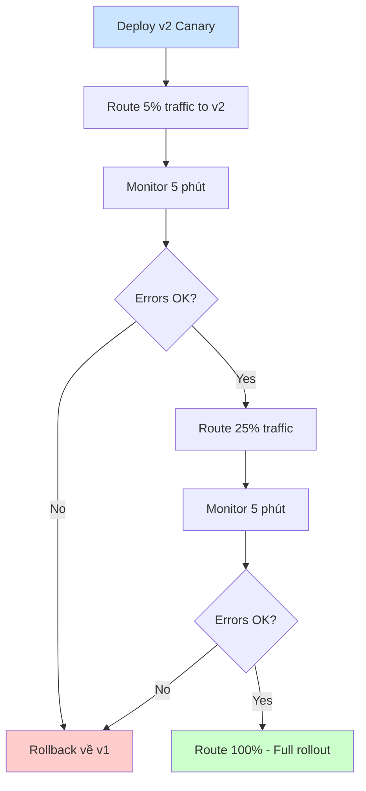

**Cổng Release (kiểm tra tự động trước mỗi phase):**

| Giai đoạn | Kiểm tra | Ngưỡng |
|-------|-------|-----------|
| **Pre-canary** | Tất cả tests đạt | ✅ |
| | Security scan đạt | ✅ |
| | Staging smoke test đạt | ✅ |
| **Canary → 25%** | Error rate | < 0.1% |
| | Latency P99 | < 500ms |
| | Thời gian ở canary | > 5 phút |
| **25% → 100%** | Error rate | < 0.1% |
| | Latency P99 | < 500ms |
| | Thời gian | > 5 phút |
| | Critical alerts | Không có |

**Quy trình Rollback:**

```bash
#!/bin/bash
# rollback.sh

set -e

echo "Starting rollback..."

# 1. Get previous revision
PREV_REVISION=$(kubectl rollout history deployment/order-service -o jsonpath='{.revision}' | tail -2 | head -1)

# 2. Rollback
kubectl rollout undo deployment/order-service --to-revision=$PREV_REVISION

# 3. Wait for rollout
kubectl rollout status deployment/order-service --timeout=5m

# 4. Verify health
./scripts/health-check.sh

# 5. Notify
curl -X POST $SLACK_WEBHOOK -d '{"text":"Rollback completed for order-service"}'

echo "Rollback completed"
```

**Tích hợp Feature Flags:**

```go
// Using LaunchDarkly / Unleash / custom
func CreateOrder(ctx context.Context, req CreateOrderRequest) (*Order, error) {
    // Check feature flag
    if featureFlags.IsEnabled("new-checkout-flow", ctx.User()) {
        return newCheckoutFlow(ctx, req)
    }
    return legacyCheckoutFlow(ctx, req)
}
```

---

## 6) 11 quyết định SA phải document

| # | Quyết định | Ví dụ |
|---|----------|---------|
| 1 | Service boundaries | "Order và Payment là 2 services riêng" |
| 2 | Architecture style | "Microservices với event-driven cho async" |
| 3 | Communication | "REST cho sync, RabbitMQ cho async" |
| 4 | Application Programming Interface specs | "OpenAPI 3.0, error format chuẩn" |
| 5 | Database | "PostgreSQL, eventual consistency giữa services" |
| 6 | Migration strategy | "Expand/contract, zero-downtime" |
| 7 | Deployment | "Elastic Kubernetes Service, 3 Availability Zones, Canary deployment" |
| 8 | Continuous Integration/Continuous Deployment | "GitHub Actions, Terraform for Infrastructure as Code" |
| 9 | Observability | "Datadog for all three pillars" |
| 10 | Security | "JSON Web Token + Role-Based Access Control, Vault for secrets" |
| 11 | Release | "Canary với automated rollback" |

---

## 7) SA bàn giao gì cho team

### SA giao (trước khi dev bắt đầu code):
- [ ] Context Diagram
- [ ] Component Diagram với ownership
- [ ] OpenAPI specs cho tất cả services
- [ ] Entity Relationship Diagram với migration strategy
- [ ] Architecture Decision Records cho mọi quyết định lớn
- [ ] Continuous Integration/Continuous Deployment pipeline config
- [ ] Monitoring dashboards
- [ ] Alert rules + Runbooks
- [ ] Security checklist

### Tech Lead tự làm:
- Code structure bên trong service
- Unit test strategy
- Code conventions
- Sprint planning

---

## 8) SA Survival Guide: Critical Moments trong Project

### 8.1 Code Freeze & Cutoff Deploy

**Code Freeze là gì?**
Thời điểm ngừng merge code mới vào branch release. Chỉ cho phép bug fixes critical.

**Timeline chuẩn:**

| Mốc | Thời điểm | SA làm gì |
|-----------|-----------|-----------|
| Feature Freeze | T-2 tuần | Review tất cả features đã merge, đánh giá rủi ro |
| Code Freeze | T-1 tuần | Chỉ accept critical bug fixes, review mọi PR |
| Cutoff Deploy | T-2 ngày | Deploy bản cuối lên staging, full regression test |
| Release | T-0 | Deploy production, monitor 24h |

**SA phải làm trước Code Freeze:**
- [ ] Tất cả Architecture Decision Records đã được approve
- [ ] Tất cả Application Programming Interface specs đã finalize
- [ ] Tất cả database migrations đã test trên staging
- [ ] Performance test đạt target NFRs
- [ ] Security scan đạt
- [ ] Rollback plan đã document và test

**Danh sách kiểm tra Cutoff Deploy:**

| Hạng mục | Kiểm tra |
|----------|-------|
| **Code** | Tất cả tests đạt |
| | Code coverage đạt ngưỡng |
| | Không có Sonar issues critical |
| | Dependencies đã cập nhật |
| **Infra** | Changes đã apply staging trước 3 ngày |
| | Auto-scaling đã cấu hình |
| | Backup đã xác minh |
| | Disaster Recovery tested trong 30 ngày |
| **Monitoring** | Alerts đã cấu hình |
| | Dashboards sẵn sàng |
| | On-call đã xác nhận |
| | Runbooks đã cập nhật |
| **Rollback** | Script đã test |
| | Phiên bản trước có sẵn |
| | DB rollback plan ready |
| | Feature flags đã cấu hình |

### 8.2 Các điểm quyết định quan trọng

**Khi nào SA PHẢI có mặt:**

| Tình huống | Tại sao critical | SA hành động |
|-----------|------------------|-----------|
| **Thay đổi Architecture** | Ảnh hưởng toàn hệ thống | Review, Architecture Decision Record, approval |
| **Integration mới** | Phụ thuộc bên ngoài | Review Application Programming Interface, failure modes |
| **Thay đổi Database Schema** | Không rollback được dễ | Migration strategy, backward compatibility |
| **Security Incident** | Ảnh hưởng business | Điều phối xử lý, post-mortem |
| **Performance xuống** | Ảnh hưởng user | Tìm nguyên nhân, xử lý ngay |
| **Major Release** | Rủi ro cao | Quyết định Go/No-go |

### 8.3 Go/No-Go Decision Framework

**Trước mỗi major release, SA phải trả lời:**

| Câu hỏi | Go | No-Go |
|----------|-----|-------|
| Tất cả critical bugs đã fix? | ✅ | ❌ |
| Performance test đạt NFRs? | ✅ | ❌ |
| Security scan sạch? | ✅ | ❌ |
| Rollback đã test? | ✅ | ❌ |
| On-call team sẵn sàng? | ✅ | ❌ |
| Stakeholders đã thông báo? | ✅ | ❌ |
| Monitoring sẵn sàng? | ✅ | ❌ |

**Nếu 1 item = No-Go → KHÔNG release.**

### 8.4 Incident Response - Vai trò SA

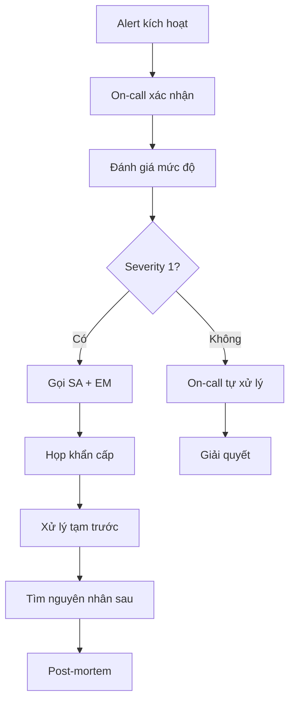

**SA trong incident:**
1. **KHÔNG debug code** - để Dev làm
2. **Điều phối** - ai làm gì, timeline
3. **Quyết định** - rollback hay hotfix?
4. **Thông báo** - cập nhật cho stakeholders
5. **Ghi chép** - timeline, hành động, quyết định

### 8.5 Post-Mortem Template

| Mục | Nội dung |
|---------|---------|
| **Tiêu đề** | [Tên incident] |
| **Thời lượng** | Bắt đầu → Kết thúc (X giờ) |
| **Ảnh hưởng** | X% users, Y orders fail |
| **Nguyên nhân gốc** | 1-2 câu |
| **Timeline** | Alert → Xác nhận → Gọi người → Fix → Xong |
| **Sai ở đâu** | Các điểm |
| **Đúng ở đâu** | Các điểm |
| **Việc cần làm** | Việc / Người / Deadline |
| **Bài học** | Những điểm rút ra |

### 8.6 Thời điểm Capacity Planning

**SA phải xem xét capacity khi:**

| Dấu hiệu | Hành động |
|---------|--------|
| Traffic tăng > 50% trong 1 tháng | Scale up hoặc optimize |
| CPU usage avg > 70% | Thêm instances hoặc optimize |
| Database connections > 80% pool | Tăng pool hoặc thêm replica |
| Disk usage > 70% | Clean up hoặc expand |
| Error rate tăng | Điều tra bottleneck |
| Sắp có campaign/event | Pre-scale |

### 8.7 Technical Debt Review

**Danh sách review hàng quý:**

| Hạng mục | Kiểm tra | Hành động nếu fail |
|----------|-------|------------------|
| Dependencies | Có outdated > 6 tháng? | Lên kế hoạch update |
| Security | Có vulnerabilities? | Patch ngay |
| Performance | Latency tăng so với baseline? | Optimize |
| Code | Có modules complexity cao? | Lên kế hoạch refactor |
| Infra | Có deprecated services? | Lên kế hoạch migration |
| Documentation | ADRs có outdated? | Update |

### 8.8 Các mốc thông báo

**SA phải thông báo:**

| Khi nào | Cho ai | Nội dung |
|------|---------|------|
| Tuần trước sprint | Tech Lead | Architecture decisions cho sprint |
| Sau major decision | Team | Architecture Decision Record và rationale |
| Trước release | Stakeholders | Đánh giá rủi ro, go/no-go |
| Sau incident | Tất cả | Post-mortem findings |
| Hàng tháng | Management | Technical health report |
| Hàng quý | Tất cả teams | Architecture roadmap |

### 8.9 Red Flags - Khi nào phải escalate

**Escalate ngay nếu:**

| Dấu hiệu nguy hiểm | Escalate cho |
|----------|-------------|
| Nghi ngờ security breach | Security team + Management |
| Mất dữ liệu | Management + Legal (nếu Personally Identifiable Information) |
| Performance < 50% baseline | Tech Lead + Management |
| External service down > 1 giờ | Vendor + Management |
| Critical bug không fix được | Tech Lead + Product |
| Team conflict về architecture | Engineering Manager |
| Budget vượt > 20% | Management + Finance |

### 8.10 SA Anti-Patterns (Tránh làm)

| Anti-Pattern | Hậu quả | Làm thay vì |
|--------------|---------|-------------|
| Design trong silo | Team không hiểu, implement sai | Involve team từ đầu |
| Over-engineering | Chậm delivery, phức tạp | Bắt đầu đơn giản, phát triển dần |
| Bỏ qua technical debt | System xuống cấp | Review định kỳ |
| Bỏ qua documentation | Mất kiến thức | Viết document ngay khi làm |
| Assume thay vì verify | Bugs trong production | Test các giả định |
| Blame thay vì learn | Team mất tinh thần | Blameless post-mortem |
| Micromanage implementation | Team bực bội | Trust nhưng verify |

---

## 9) TL;DR - SA Cheat Sheet

### SA làm gì trong 1 ngày

| Thời gian | Việc |
|-----------|------|
| 9:00 | Check dashboards, alerts đêm qua |
| 9:30 | Standup - nghe blockers, đưa decisions |
| 10:00 | Review PRs có architectural impact |
| 11:00 | Meeting với Tech Leads - sync technical direction |
| 14:00 | Viết/update ADRs, specs |
| 15:00 | 1:1 với DevOps - infra planning |
| 16:00 | Research new tech, Proof of Concept (Bằng chứng khái niệm) nếu cần |

### SA KHÔNG làm gì

- ❌ Code features
- ❌ Fix bugs (trừ khi architectural bug)
- ❌ Manage sprint/assign tasks
- ❌ Micromanage code style
- ❌ Quyết định business requirements

### Câu hỏi SA phải trả lời được

| Câu hỏi | Nếu không trả lời được |
|---------|------------------------|
| "Latency P99 là bao nhiêu?" | Cần setup metrics |
| "Khi service X chết thì sao?" | Cần design failure modes |
| "Scale 10x thì tốn bao nhiêu?" | Cần tính cost model |
| "Rollback như thế nào?" | Cần viết rollback plan |
| "Tại sao chọn tech này?" | Cần viết Architecture Decision Record |

### 12 Steps Quick Reference

| Bước | Output | Xong khi |
|------|--------|----------|
| 1. Scope | Scope doc | PO sign-off |
| 2. Non-Functional Requirements | Non-Functional Requirements spec có số | Stakeholders đồng ý |
| 3. Context Diagram | System boundary | Tất cả externals đã list |
| 4. Component Diagram | Services + owners | Mỗi box có owner |
| 5. Compare Options | Decision matrix | Đã chọn option với rationale |
| 6. ADRs | Decision docs | Tất cả major decisions đã viết |
| 7. Application Programming Interface Design | Endpoints + schemas | FE/BE đồng bộ |
| 8. Database | Entity Relationship Diagram + indexes | Migration plan sẵn sàng |
| 9. Continuous Integration/Continuous Deployment | Pipeline config | Auto deploy hoạt động |
| 10. Observability | Dashboards + alerts | On-call có thể debug |
| 11. Security | Checklist đạt | Không có lỗ hổng critical |
| 12. Release | Canary + rollback | Quy trình deploy an toàn |

### Dấu hiệu cần hành động ngay

| Dấu hiệu | Hành động |
|--------|--------|
| Error rate > 1% | Điều tra ngay |
| Latency P99 tăng 2x | Check bottleneck |
| DB CPU > 80% | Scale hoặc optimize |
| Không có rollback plan | Viết trước khi deploy |
| Team không hiểu architecture | Lên lịch walkthrough |

### SA vs Tech Lead - 1 câu

> **SA**: "System chạy production như thế nào?"
> **Tech Lead**: "Code trong service này viết như thế nào?"

### Khi bí, hỏi

1. "Nếu 3AM có incident, on-call có fix được không?"
2. "Nếu traffic 10x, system có handle được không?"
3. "Nếu service này chết, user thấy gì?"
4. "6 tháng sau, new member có hiểu architecture không?"

---

## 10) Case Study: E-Commerce Platform - SA Deep Dive

> Phần này đi sâu vào tư duy SA khi phân tích bài toán E-Commerce. Đây là cách SA thực sự làm việc - không chỉ output mà còn quá trình suy nghĩ.

### 10.1 Buổi họp đầu tiên - SA hỏi gì?

**Bối cảnh:** CEO: "Tao muốn làm e-commerce, 3 tháng launch, $50k/tháng budget."

**SA KHÔNG nói:** "OK, để em design."

**SA HỎI:**

| Câu hỏi | Tại sao hỏi | Ảnh hưởng |
|---------|-------------|-----------|
| "Target bao nhiêu users sau 6 tháng?" | Sizing infrastructure | 10k → 1 server, 1M → cluster |
| "Peak traffic khi nào?" | Capacity planning | Flash sale 10x → auto-scaling |
| "Bán gì? Vật lý hay digital?" | Inventory, shipping | Vật lý → logistics API |
| "Thanh toán những gì?" | PCI compliance | Credit card → PCI-DSS |
| "Data nhạy cảm gì?" | Security architecture | CCCD → encryption bắt buộc |
| "Team hiện tại biết gì?" | Tech stack | Team biết Go → dùng Go |
| "Có legacy system nào?" | Migration complexity | Có ERP → adapter layer |
| "3 tháng là hard hay soft deadline?" | Risk tolerance | Hard → cut features |

**Output sau buổi họp:**

```
Meeting Notes - E-Commerce Kickoff
Date: 2024-01-15

KEY DECISIONS:
- Target: 100k users, 10k orders/ngày
- Payment: VNPay, Momo, Cash on Delivery (Không có thẻ tín dụng)
- Timeline: HARD deadline - investor demo 15/4
- Budget: $50k infra, $10k tools

RISKS:
1. 3 tháng tight cho Minimum Viable Product
2. Team chưa làm payment integration
3. Logistics partner chưa chốt

ACTIONS:
- SA: Draft architecture by EOW
- PO: Finalize features by Wed
- CTO: Confirm logistics by Fri
```

### 10.2 Risk Analysis

**SA làm Risk Matrix TRƯỚC khi design:**

| Rủi ro | Xác suất | Ảnh hưởng | Điểm | Giảm thiểu |
|--------|----------|-----------|------|------------|
| Payment integration fail | Cao | Critical | 🔴 | Proof of Concept tuần 1, fallback Cash on Delivery |
| Không kịp deadline | TB | Critical | 🔴 | Cut features, parallel work |
| Performance không đạt | TB | High | 🟠 | Load test sớm, cache |
| Security breach | Thấp | Critical | 🟠 | Pentest, security review |
| Logistics Application Programming Interface unstable | Cao | Medium | 🟡 | Circuit breaker, manual fallback |

**Risk Response:**

```
CRITICAL RISKS (🔴):

1. Payment Integration Fail
   - Week 1: Proof of Concept VNPay sandbox
   - Week 2: Fail → switch Momo
   - Fallback: Launch Cash on Delivery only
   - Owner: Team B + SA review

2. Không kịp deadline
   - Minimum Viable Product: Browse, Cart, Checkout, Order tracking
   - CUT: Advanced search, Wishlist, Reviews
   - Weekly checkpoint với CEO
```

### 10.3 Capacity Planning

**SA tính từ business → technical specs:**

```
INPUT:
- 10,000 orders/ngày
- 100,000 users sau 6 tháng
- Peak: Flash sale 10x
- Page load < 3s

CALCULATIONS:

1. REQUESTS PER SECOND
   - 10,000 orders/ngày ÷ 86,400 = 0.12 orders/sec
   - 80% orders trong 8h (10AM-6PM)
   - → 8,000 ÷ 28,800 = 0.28 orders/sec peak
   - Mỗi order = ~20 Application Programming Interface calls
   - → 0.28 × 20 = 5.6 req/sec orders
   - Browse traffic = 10x orders
   - → ~60 req/sec normal, 600 req/sec flash sale

2. DATABASE SIZING
   - Orders: 10k/ngày × 365 = 3.65M rows/năm
   - Order items: 3 items/order = 11M rows/năm
   - Total: ~15M rows/năm = ~5GB/năm
   - → Relational Database Service db.t3.medium đủ năm đầu

3. INSTANCE SIZING
   - 600 req/sec peak
   - Go: ~1000 req/sec per core với DB
   - → 2× t3.small với auto-scaling to 4

4. CACHE SIZING
   - Products: 10,000 × 2KB = 20MB
   - Sessions: 10,000 × 1KB = 10MB
   - → Redis t3.small
```

**Capacity Summary:**

| Component | Size | Cost/month | Scale Trigger |
|-----------|------|------------|---------------|
| Elastic Kubernetes Service Cluster | 2 nodes t3.medium | $140 | CPU > 70% |
| Relational Database Service PostgreSQL | db.t3.medium Multi-Availability Zone | $130 | Connections > 80% |
| ElastiCache Redis | cache.t3.small | $25 | Memory > 70% |
| Application Load Balancer | 1 | $20 | - |
| Simple Storage Service + CloudFront | 100GB | $30 | - |
| Network Address Translation Gateway | 1 | $45 | - |
| **Total** | | **~$390** | |

### 10.4 Failure Mode Analysis

**SA map MỌI cách system có thể chết:**

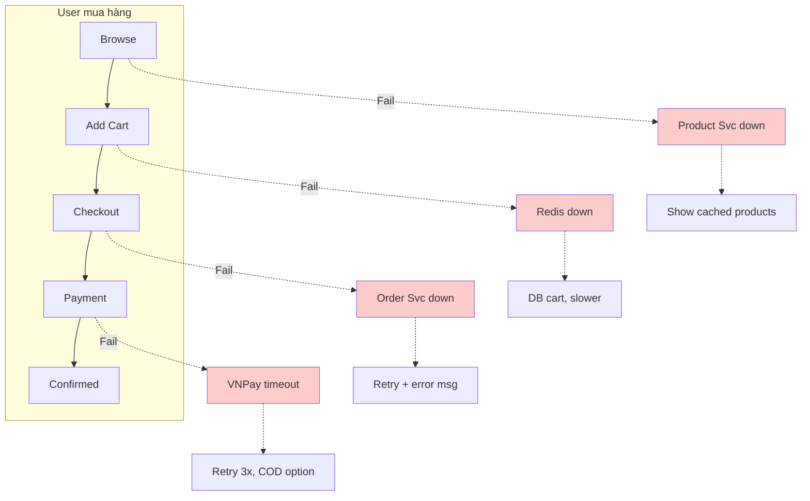

**Failure Mode Table:**

| Component | Failure | User thấy | Mitigation | Recovery Time Objective |
|-----------|---------|-----------|------------|-----|
| Product Service | Crash | Trang trắng | Cache, restart | 30s |
| | Slow >2s | Loading lâu | Timeout, cached | 2s |
| Redis | Down | Cart mất | Persist DB | 1min |
| Order Service | Crash | Checkout fail | Retry, error | 30s |
| | Duplicate | 2 đơn | Idempotency key | - |
| VNPay | Timeout | Chờ lâu | 30s timeout, retry | 30s |
| | Callback fail | Đã trừ tiền, pending | Reconciliation job | 5min |
| Database | Primary down | Write fail | Failover standby | 1min |

**Critical Path:**

```
CRITICAL (không fallback, phải hoạt động):
Order Service → Payment → Database write
- Fail = User không mua được = mất tiền
- Service Level Agreement (Thỏa thuận mức độ dịch vụ): 99.9% = 8.7h downtime/năm max

NON-CRITICAL (có fallback):
- Notification → Order vẫn OK
- Analytics → Mất data, user không ảnh hưởng
- Search → Fallback category browse
```

### 10.5 Data Flow - Checkout

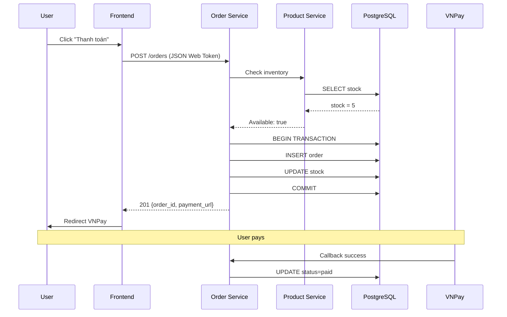

**Transaction Boundaries:**

```sql
-- Order creation (MUST be atomic)
BEGIN;
  INSERT INTO orders (id, user_id, status, total)
    VALUES ($1, $2, 'pending', $3);

  INSERT INTO order_items (order_id, product_id, qty, price)
    SELECT $1, product_id, quantity, price
    FROM cart_items WHERE user_id = $2;

  UPDATE products SET stock = stock - oi.quantity
    FROM order_items oi
    WHERE products.id = oi.product_id;

  DELETE FROM cart_items WHERE user_id = $2;
COMMIT;
-- Fail any step → ROLLBACK all
```

### 10.6 Integration Points

| Integration | Type | Timeout | Retry | Circuit Breaker | Fallback |
|-------------|------|---------|-------|-----------------|----------|
| VNPay | External | 30s | 3x exp | Yes, 5 fails | Cash on Delivery option |
| Momo | External | 30s | 3x exp | Yes, 5 fails | VNPay/Cash on Delivery |
| GHN Shipping | External | 10s | 2x | Yes, 3 fails | Manual |
| SendGrid | External | 5s | 5x async | Yes, 10 fails | Queue later |
| Internal | Internal | 2s | 2x | Yes, 5 fails | Error |

### 10.7 Project Roadmap (12 tuần)

**Visual Timeline:**

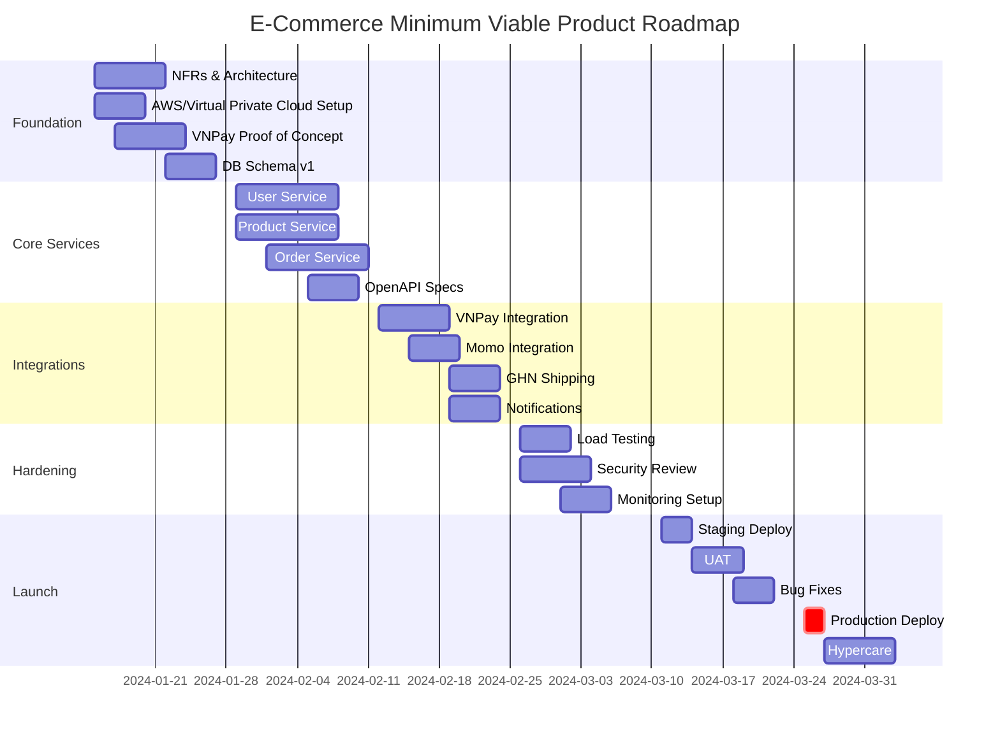

**Team Allocation Timeline:**

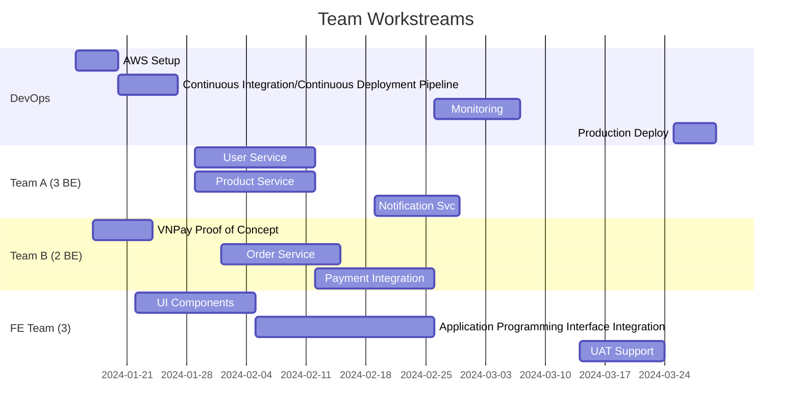

**Milestone Gates:**

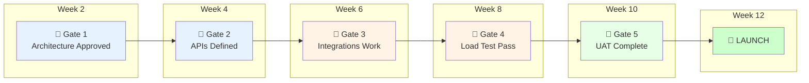

**Gate Criteria:**

| Gate | Criteria | Blocker nếu fail |
|------|----------|------------------|
| Gate 1 | Non-Functional Requirements signed, diagrams reviewed, VNPay Proof of Concept works | Không có architecture → team code lung tung |
| Gate 2 | OpenAPI specs done, DB schema approved | FE/BE không sync → integration hell |
| Gate 3 | Payment + Shipping APIs work end-to-end | Core flow broken → không có product |
| Gate 4 | 600 req/s, P99 < 500ms, no critical bugs | Performance issues in prod |
| Gate 5 | PO sign-off, all critical bugs fixed | User-facing issues |
| Launch | Go/No-Go checklist 100% | 🔥 Production fire |

### 10.8 Infrastructure Diagram

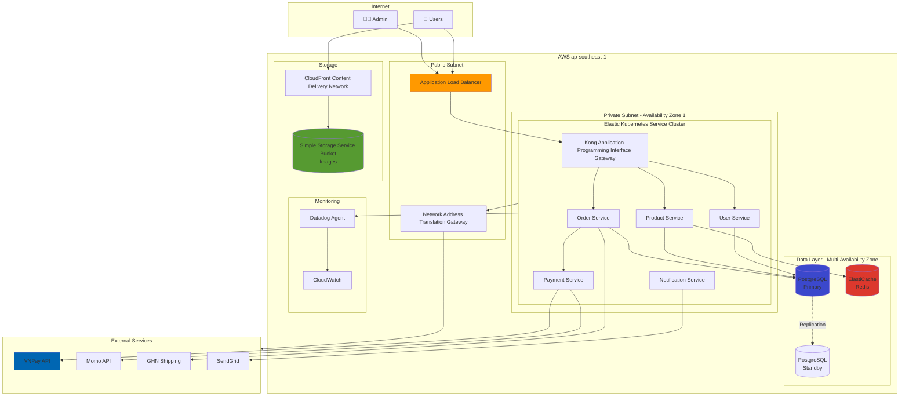

**Network Security:**

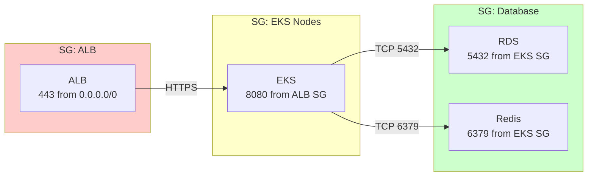

### 10.9 Architecture Evolution Roadmap

**Phase 1: MVP (Month 1-3)**

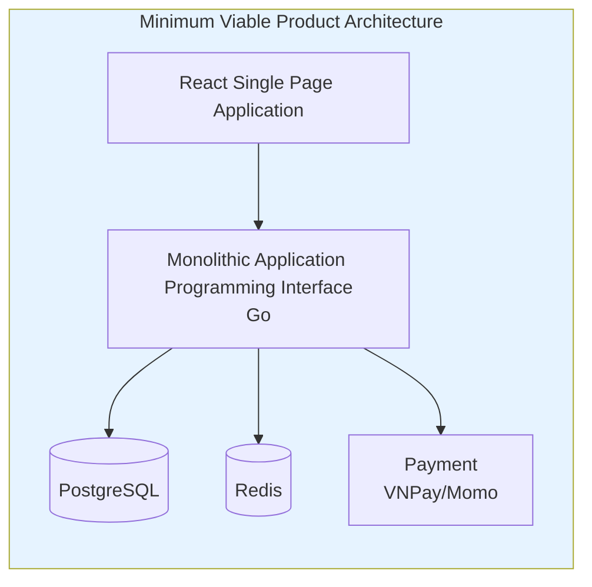

**Phase 2: Scale (Month 4-6)**

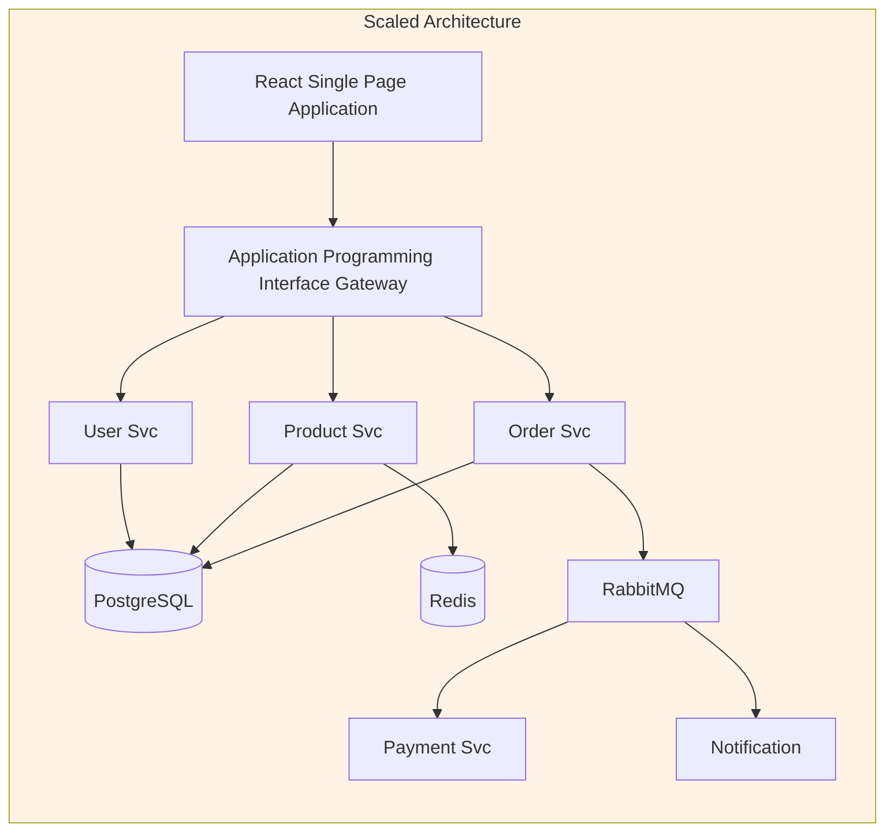

**Phase 3: Enterprise (Month 7-12)**

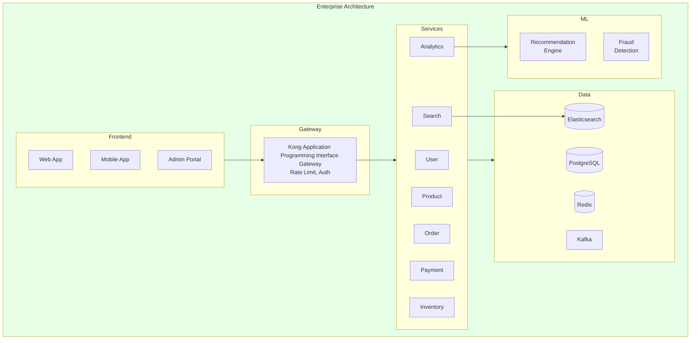

**Evolution Decision Points:**

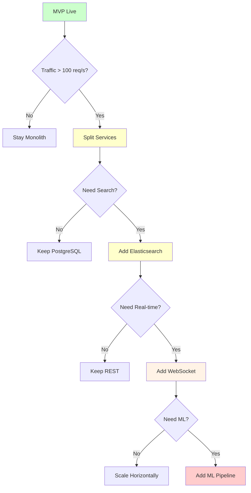

### 10.10 Team Structure & Responsibilities

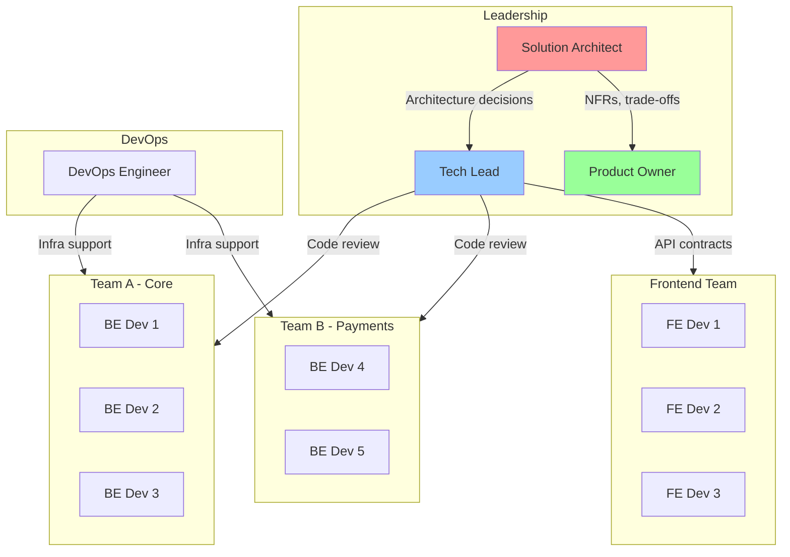

**RACI Matrix:**

```mermaid
flowchart LR
    subgraph RACI["Responsibility Matrix"]
        direction TB
        subgraph Tasks
            T1[Architecture Design]
            T2[API Specs]
            T3[Code Implementation]
            T4[Code Review]
            T5[Deployment]
            T6[Monitoring]
            T7[Incident Response]
        end
    end
```

| Task | SA | Tech Lead | Dev | DevOps | PO |
|------|:--:|:---------:|:---:|:------:|:--:|
| Architecture Design | **R** | C | I | C | A |
| Non-Functional Requirements Definition | **R** | C | I | C | A |
| Application Programming Interface Specs | A | **R** | C | I | I |
| Code Implementation | I | A | **R** | I | I |
| Code Review | I | **R** | C | I | I |
| Deployment | C | C | I | **R** | I |
| Monitoring Setup | C | C | I | **R** | I |
| Incident Response | C | **R** | C | C | I |
| Go/No-Go Decision | **R** | C | I | C | A |

*R=Responsible, A=Accountable, C=Consulted, I=Informed*

### 10.11 Deployment Pipeline

```mermaid
flowchart LR
    subgraph Dev["Development"]
        Code[👨‍💻 Code] --> PR[Pull Request]
        PR --> Review[Code Review]
    end

    subgraph CI["CI Pipeline"]
        Review --> Test[Unit Tests]
        Test --> Lint[Lint + Security]
        Lint --> Build[Build Image]
        Build --> Push[Push to Elastic Container Registry]
    end

    subgraph CD["CD Pipeline"]
        Push --> DevEnv[Deploy Dev]
        DevEnv --> IntTest[Integration Test]
        IntTest --> Staging[Deploy Staging]
        Staging --> UAT[UAT Test]
        UAT --> Approve{Manual Approve?}
        Approve -->|Yes| Canary[Canary 5%]
        Approve -->|No| Fix[Fix Issues]
        Fix --> Code
        Canary --> Monitor{Metrics OK?}
        Monitor -->|Yes| Prod25[Prod 25%]
        Monitor -->|No| Rollback[Rollback]
        Prod25 --> Prod100[Prod 100%]
    end

    style Code fill:#e6f3ff
    style Canary fill:#ffffcc
    style Prod100 fill:#ccffcc
    style Rollback fill:#ffcccc
```

**Pipeline Stages Detail:**

```mermaid
flowchart TB
    subgraph Stage1["Stage 1: Build"]
        S1A[Checkout Code]
        S1B[Install Deps]
        S1C[Run Tests]
        S1D[Build Binary]
        S1E[Build Docker]
        S1A --> S1B --> S1C --> S1D --> S1E
    end

    subgraph Stage2["Stage 2: Security"]
        S2A[Static Application Security Testing Scan]
        S2B[Dependency Check]
        S2C[Container Scan]
        S2A --> S2B --> S2C
    end

    subgraph Stage3["Stage 3: Deploy"]
        S3A[Push Image]
        S3B[Update K8s]
        S3C[Health Check]
        S3D[Smoke Test]
        S3A --> S3B --> S3C --> S3D
    end

    Stage1 --> Stage2 --> Stage3

    style Stage1 fill:#e6f3ff
    style Stage2 fill:#fff3e6
    style Stage3 fill:#e6ffe6
```

### 10.12 Cost Breakdown

```
AWS (ap-southeast-1):
├── Compute
│   ├── EKS: $73/month
│   ├── EC2 t3.medium ×2: $67/month
│   └── Network Address Translation Gateway: $45/month
├── Database
│   ├── Relational Database Service Multi-Availability Zone: $130/month
│   └── Redis: $25/month
├── Storage
│   ├── S3 100GB: $2/month
│   ├── EBS: $10/month
│   └── CloudFront: $50/month
├── Networking
│   └── ALB: $20/month
└── Monitoring: $10/month

TOTAL AWS: ~$435/month

OTHER:
├── Datadog: $500/month
├── GitHub Team: $44/month
├── SendGrid: $15/month
└── Slack: $75/month

TOTAL OTHER: ~$635/month

GRAND TOTAL: ~$1,070/month

COST PER ORDER (10k/ngày):
= $1,070 ÷ 300,000 = $0.0036/order ✅
```

**Scaling Projection:**

| Stage | Orders/day | Cost | Per Order |
|-------|------------|------|-----------|
| MVP | 1,000 | $600 | $0.02 |
| 3 months | 10,000 | $1,100 | $0.004 |
| 6 months | 30,000 | $2,500 | $0.003 |
| 12 months | 100,000 | $6,000 | $0.002 |

### 10.9 Production Readiness Checklist

**Infrastructure:**
- [ ] Multi-Availability Zone configured
- [ ] Auto-scaling (CPU > 70%)
- [ ] Backups verified
- [ ] SSL certificates
- [ ] DNS health checks

**Security:**
- [ ] Secrets in Secrets Manager
- [ ] Rate limiting (100 req/min/user)
- [ ] WAF configured
- [ ] Security groups minimal
- [ ] Penetration test done

**Observability:**
- [ ] Structured logs
- [ ] Trace ID propagation
- [ ] Dashboard: RPS, Error, P99
- [ ] Alerts configured
- [ ] On-call rotation
- [ ] Runbooks ready

**Reliability:**
- [ ] Health checks
- [ ] Circuit breakers
- [ ] Retry policies
- [ ] Timeouts set
- [ ] Graceful shutdown
- [ ] Connection pooling

**Performance:**
- [ ] Load test passed (600 req/s)
- [ ] No N+1 queries
- [ ] Caching works
- [ ] Content Delivery Network for assets
- [ ] Gzip enabled

### 10.10 Post-Launch

**Day 1-7: Hypercare**

| Ngày | Focus |
|------|-------|
| 1 | Monitor 24/7, war room |
| 2 | Review overnight, fix issues |
| 3-5 | Daily standup, feedback |
| 6-7 | Document lessons, relax alerts |

**Ongoing:**

| Task | Frequency |
|------|-----------|
| Dashboard review | Daily |
| Cost optimization | Weekly |
| Security scan | Weekly |
| Architecture review | Bi-weekly |
| Capacity planning | Monthly |
| Disaster Recovery drill | Quarterly |

---

## 11) SA Templates

### 11.1 Architecture Review Checklist

```markdown
## Functionality
- [ ] Solves business problem?
- [ ] Edge cases handled?

## Reliability
- [ ] Failure modes considered?
- [ ] Retry/timeout/circuit breaker?
- [ ] Data consistency?

## Performance
- [ ] N+1 queries?
- [ ] Need cache?
- [ ] Async where possible?

## Security
- [ ] Input validation?
- [ ] Auth/authz correct?
- [ ] Sensitive data protected?

## Operability
- [ ] Logs have context?
- [ ] Metrics exposed?
- [ ] Config externalized?
```

### 11.2 Incident Response Checklist

```markdown
## Severity
- [ ] Sev1: System down, all users
- [ ] Sev2: Major feature broken
- [ ] Sev3: Minor issue

## First 5 minutes
- [ ] Acknowledge alert
- [ ] Recent deploy? → ROLLBACK
- [ ] No → Continue investigation

## Investigation (5-30 min)
- [ ] Check error logs
- [ ] Check metrics
- [ ] Check dependencies
- [ ] Identify component

## Resolution
- [ ] Fix or workaround
- [ ] Verify in production
- [ ] Monitor 15 minutes
- [ ] Close incident

## Post-Incident
- [ ] Write timeline
- [ ] Schedule post-mortem
- [ ] Create action items
- [ ] Update runbooks
```

---

**Tài liệu tham khảo:**
- [AWS Architecture Decision Record Best Practices](https://aws.amazon.com/blogs/architecture/master-architecture-decision-records-adrs-best-practices-for-effective-decision-making/)
- [Google Cloud Architecture Decision Record Guide](https://cloud.google.com/architecture/architecture-decision-records)
- [Microsoft Azure Well-Architected Framework](https://learn.microsoft.com/en-us/azure/well-architected/architect-role/architecture-decision-record)
- [Architecture Decision Record Templates](https://adr.github.io/)
