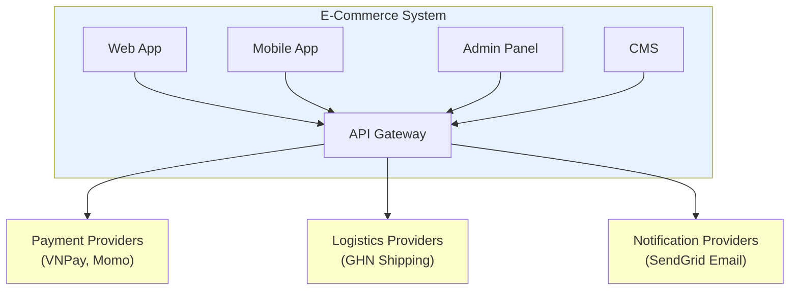
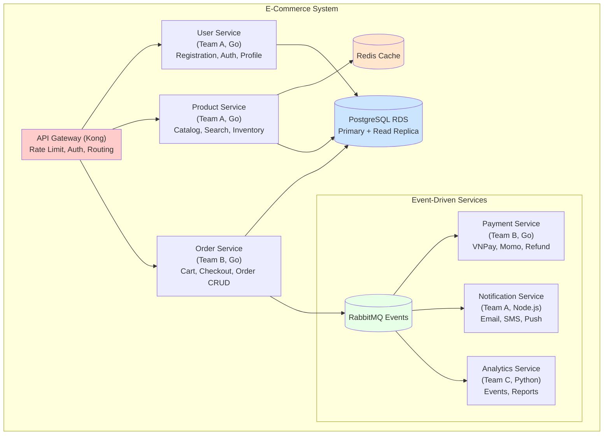
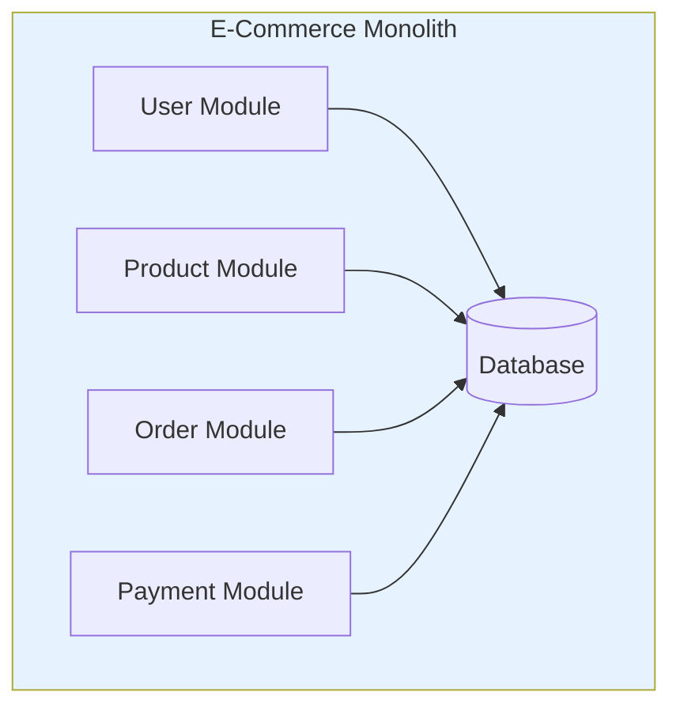
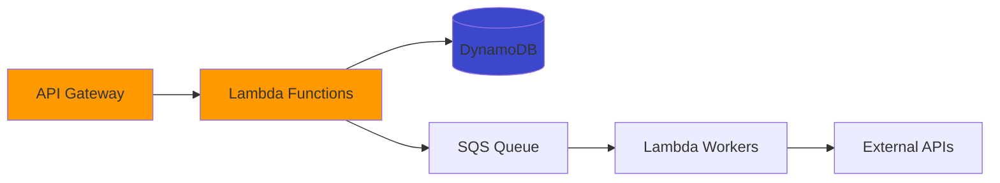
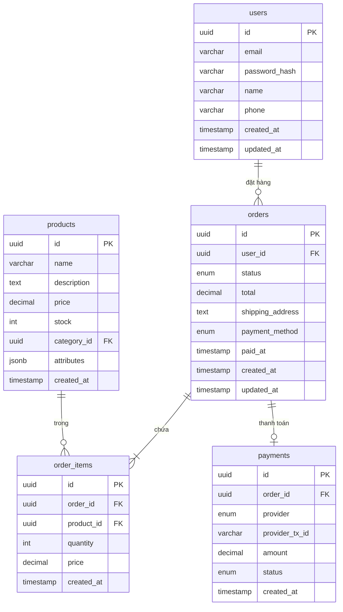
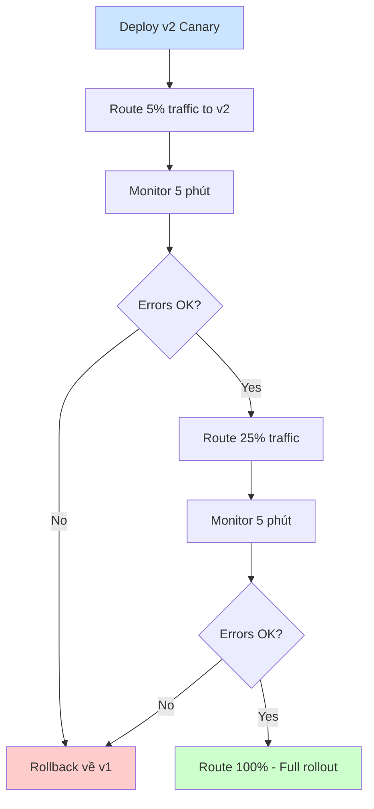
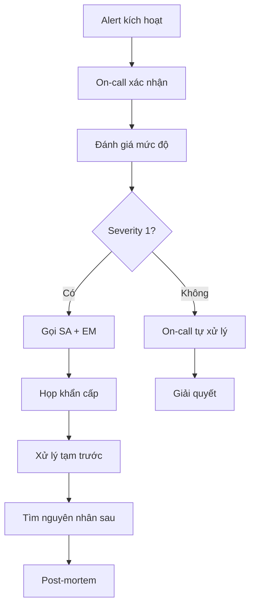

# Sổ tay Solution Architect

Tài liệu này viết cho dev muốn hiểu SA làm gì, hoặc dev đang chuyển sang làm SA.

---

## 1) SA là gì

SA (Solution Architect) là người chịu trách nhiệm cho câu hỏi: **"Hệ thống này được xây như thế nào để chạy được trên production?"**

SA không code, nhưng mọi bug liên quan đến architecture đều là lỗi của SA:
- Service A gọi service B timeout → SA đã không define timeout và retry policy
- Database bị lock → SA đã không tính đến concurrent writes
- Release xong thì chết → SA đã không có rollback plan
- Bill cloud tăng 10x → SA đã không tính cost khi scale

**SA khác gì Tech Lead?**

| | SA | Tech Lead |
|---|---|---|
| Quyết định | Hệ thống gồm những gì, deploy ở đâu | Code bên trong mỗi service viết như thế nào |
| Scope | Cross-team, cross-service | Trong 1 team, 1-2 services |
| Output | Diagrams, specs, ADRs | Code, PRs, code reviews |
| Fail khi | Production chết vì architecture | Sprint delay vì code quality |

---

## 2) 6 góc nhìn khi thiết kế (Quality Attributes)

Mỗi quyết định của SA đều phải cân nhắc 6 góc:

### 2.1 Operability (Vận hành)

**Câu hỏi:** "Khi 3h sáng có alert, on-call có debug được không?"

**Kiểm tra:**
- [ ] Log có đủ context (request_id, user_id, timestamp)?
- [ ] Có dashboard để nhìn health?
- [ ] Có runbook để follow?
- [ ] Có thể restart service mà không mất data?

**Anti-pattern:** Log chỉ có `Error occurred` không có stack trace, không có request context → debug mất 2 tiếng.

### 2.2 Security (Bảo mật)

**Câu hỏi:** "Nếu attacker có access vào server này, họ lấy được gì?"

**Kiểm tra:**
- [ ] Secrets có trong env var plain text không? → Phải dùng Vault/Secrets Manager
- [ ] API có auth không? Token có expire không?
- [ ] Data nhạy cảm (PII, payment) có encrypt không?
- [ ] Có audit log ai làm gì không?

**Chuyện thật:** Một team commit `.env` file vào git, bị bot scan GitHub và hack AWS account trong 15 phút, bill $50k.

### 2.3 Reliability (Tin cậy)

**Câu hỏi:** "Khi component X chết, user thấy gì?"

**Kiểm tra:**
- [ ] Có circuit breaker không? Khi downstream chết thì không cascade failure
- [ ] Có retry với exponential backoff không?
- [ ] Có timeout cho mọi external call không?
- [ ] Database có replica không? Replica lag bao nhiêu?

**Ví dụ Circuit Breaker Pattern:**

```go
// Không có circuit breaker - cascade failure
func GetUser(id string) (*User, error) {
    return userService.Get(id) // Nếu userService chết → tất cả request đều timeout
}

// Có circuit breaker
func GetUser(id string) (*User, error) {
    result, err := circuitBreaker.Execute(func() (interface{}, error) {
        return userService.Get(id)
    })
    if err == circuit.ErrOpenState {
        return getCachedUser(id) // Fallback to cache
    }
    return result.(*User), err
}
```

### 2.4 Performance (Hiệu năng)

**Câu hỏi:** "Latency P99 là bao nhiêu? Throughput max là bao nhiêu?"

**Lưu ý:** P99 quan trọng hơn P50. Nếu P50 = 50ms nhưng P99 = 5s nghĩa là 1% user chờ 5 giây.

**Bottleneck thường gặp:**
1. **N+1 query:** Fetch 100 orders → 100 queries để lấy user của mỗi order
2. **No index:** Query trên column không có index
3. **No cache:** Mỗi request đều query DB cho data ít thay đổi
4. **Sync call khi có thể async:** Gửi email sync trong API request

**Ví dụ fix N+1:**

```sql
-- Bad: N+1 queries
SELECT * FROM orders WHERE user_id = 1;
SELECT * FROM users WHERE id = 1; -- repeated N times

-- Good: JOIN hoặc batch
SELECT o.*, u.name
FROM orders o
JOIN users u ON o.user_id = u.id
WHERE o.user_id = 1;
```

### 2.5 Cost (Chi phí)

**Câu hỏi:** "Khi traffic tăng 10x, bill tăng bao nhiêu?"

**Bẫy chi phí:**
- NAT Gateway: $0.045/GB data processed → traffic nội bộ nhiều thì tốn
- Data transfer cross-AZ: $0.01/GB
- RDS Multi-AZ: x2 cost
- Lambda: rẻ khi traffic thấp, đắt khi traffic cao liên tục

**Ví dụ tính cost:**

```
Scenario: 1M requests/day, mỗi request 100KB response

Phương án A: EC2 t3.medium
- Instance: $30/month
- ALB: $20/month
- Total: ~$50/month

Phương án B: Lambda + API Gateway
- Lambda: 1M * $0.0000002 = $0.2/month
- API Gateway: 1M * $3.5/million = $3.5/month
- Data transfer: 100GB * $0.09 = $9/month
- Total: ~$13/month

→ Lambda rẻ hơn cho traffic này
→ Nhưng nếu 100M requests/day, Lambda = $1300/month, EC2 vẫn ~$50
```

### 2.6 Sustainability (Bền vững)

**Câu hỏi:** "Có resource nào chạy mà không ai dùng không?"

**Kiểm tra:**
- [ ] Có dev/staging instances chạy 24/7 mà chỉ dùng 8h/ngày?
- [ ] Có log retention quá dài (giữ 1 năm trong khi chỉ cần 30 ngày)?
- [ ] Có over-provisioned instances (CPU usage < 10%)?

---

## 3) Roles trong team

### 3.1 SA quyết định gì

| Quyết định | Ví dụ |
|------------|-------|
| Service boundaries | "Order Service và Payment Service tách riêng" |
| Communication patterns | "Dùng REST cho sync, Kafka cho async" |
| Data storage | "PostgreSQL cho transactional, Redis cho cache, S3 cho files" |
| Deployment topology | "3 AZs, 2 replicas mỗi service" |
| Security boundaries | "Payment service trong private subnet, chỉ internal ALB access" |

### 3.2 Tech Lead quyết định gì

| Quyết định | Ví dụ |
|------------|-------|
| Code structure | "Dùng Clean Architecture" |
| Testing strategy | "Unit test coverage 80%, integration test cho happy path" |
| Code conventions | "Dùng gofmt, eslint với airbnb config" |
| Sprint execution | "Chia task, assign, review PRs" |

### 3.3 Khi team không có SA

Tech Lead phải gánh thêm:
- Vẽ architecture diagrams
- Viết ADRs
- Coordinate với DevOps về deployment
- Review NFRs với stakeholders

**Lưu ý:** Tech Lead làm SA thường thiếu góc nhìn cross-team và operations. Cần involve DevOps/SRE sớm.

### 3.4 Tech Lead → SA Transition Guide

**Thay đổi tư duy:**

| Tech Lead Mindset | SA Mindset |
|-------------------|------------|
| "Code này clean chưa?" | "System này chạy được production chưa?" |
| "Sprint này ship được không?" | "6 tháng sau system này có scale được không?" |
| "Team mình làm xong chưa?" | "Tất cả teams integrate được chưa?" |
| "Feature này implement sao?" | "Feature này ảnh hưởng gì đến system?" |

**Kỹ năng cần phát triển:**

| Skill | Tech Lead có | SA cần thêm |
|-------|-------------|-------------|
| Code review | ✅ | System design review |
| Team management | ✅ | Cross-team coordination |
| Sprint planning | ✅ | Roadmap planning |
| Debugging | ✅ | Tìm nguyên nhân ở system level |
| API design | ✅ | Integration patterns |
| Database schema | ✅ | Data architecture |
| Local testing | ✅ | Production testing |

**Cụ thể phải học:**

| Week | Focus | Deliverable |
|------|-------|-------------|
| 1-2 | NFRs | Viết NFR spec cho project hiện tại |
| 3-4 | Diagrams | Vẽ Context + Component diagram |
| 5-6 | ADRs | Viết 3 ADRs cho decisions gần đây |
| 7-8 | Observability | Setup dashboard + alerts |
| 9-10 | Security | Security review checklist |
| 11-12 | Release | Design release strategy |

**Thói quen hàng ngày thay đổi:**

| Trước (Tech Lead) | Sau (SA) |
|-------------------|----------|
| Code review 2h/ngày | System review 2h/ngày |
| 1:1 với team | 1:1 với các Tech Leads |
| Debug trong IDE | Debug trong logs/metrics |
| Read code | Read architecture docs |
| Write code | Write specs + ADRs |

**Khi nào ready cho SA role?**

- [ ] Có thể vẽ system diagram trong 10 phút
- [ ] Hiểu production metrics của system
- [ ] Biết failure modes của mỗi component
- [ ] Có thể estimate infra cost
- [ ] Có thể explain decisions cho non-tech stakeholders
- [ ] Đã handle ít nhất 1 production incident

---

## 4) Problems SA giải quyết

### 4.1 Integration Hell

**Triệu chứng:** FE và BE code xong, tích hợp thì không chạy.

**Nguyên nhân:** Không có API spec rõ ràng trước khi code.

**Giải pháp:**
1. Viết OpenAPI spec trước
2. FE/BE review và sign-off
3. Generate mock server từ spec để FE dev song song
4. BE implement theo spec
5. Contract test để ensure BE match spec

**Ví dụ Contract Test:**

```javascript
// contract.test.js
const spec = require('./openapi.json');
const api = require('./api');

describe('POST /orders', () => {
  it('should match OpenAPI spec', async () => {
    const response = await api.post('/orders', {
      user_id: 'user-123',
      items: [{ product_id: 'prod-1', quantity: 2 }]
    });

    // Validate response against spec
    expect(response.status).toBe(201);
    expect(validateAgainstSpec(response.body, spec.paths['/orders'].post.responses['201'])).toBe(true);
  });
});
```

### 4.2 Deployment Fear

**Triệu chứng:** Team sợ deploy vì hay bị incident.

**Nguyên nhân:** Không có rollback plan, không có canary, không có health checks.

**Giải pháp:**

```yaml
# Kubernetes deployment với rollback
apiVersion: apps/v1
kind: Deployment
spec:
  strategy:
    type: RollingUpdate
    rollingUpdate:
      maxSurge: 1
      maxUnavailable: 0
  template:
    spec:
      containers:
      - name: app
        livenessProbe:
          httpGet:
            path: /health
            port: 8080
          initialDelaySeconds: 10
          periodSeconds: 5
        readinessProbe:
          httpGet:
            path: /ready
            port: 8080
          initialDelaySeconds: 5
          periodSeconds: 3
```

```bash
# Rollback command
kubectl rollout undo deployment/my-app
```

### 4.3 Database Migration Disasters

**Triệu chứng:** Chạy migration xong, production chết 2 tiếng.

**Nguyên nhân:**
- Migration lock table quá lâu
- Không test với production-size data
- Không có rollback plan

**Giải pháp - Expand/Contract Pattern:**

```sql
-- Phase 1: Expand (backward compatible)
ALTER TABLE users ADD COLUMN email_new VARCHAR(255);

-- Phase 2: Migrate data (background job)
UPDATE users SET email_new = email WHERE email_new IS NULL;

-- Phase 3: Switch code to use email_new
-- Deploy code that reads/writes email_new

-- Phase 4: Contract (after all code deployed)
ALTER TABLE users DROP COLUMN email;
ALTER TABLE users RENAME COLUMN email_new TO email;
```

### 4.4 Observability Gaps

**Triệu chứng:** Alert "Error rate high" nhưng không biết error ở đâu.

**Nguyên nhân:** Log không có correlation, không có tracing.

**Giải pháp - Structured logging với trace ID:**

```go
// Middleware để inject trace ID
func TracingMiddleware(next http.Handler) http.Handler {
    return http.HandlerFunc(func(w http.ResponseWriter, r *http.Request) {
        traceID := r.Header.Get("X-Trace-ID")
        if traceID == "" {
            traceID = uuid.New().String()
        }
        ctx := context.WithValue(r.Context(), "trace_id", traceID)

        // Log với trace ID
        log.Info().
            Str("trace_id", traceID).
            Str("method", r.Method).
            Str("path", r.URL.Path).
            Msg("Request started")

        next.ServeHTTP(w, r.WithContext(ctx))
    })
}
```

### 4.5 Cost Explosion

**Triệu chứng:** AWS bill tháng này tăng 300% không rõ lý do.

**Nguyên nhân:**
- Không set budget alerts
- Không tag resources
- Không review cost weekly

**Giải pháp:**

```terraform
# Tagging strategy
resource "aws_instance" "app" {
  tags = {
    Environment = "production"
    Team        = "order-team"
    Service     = "order-service"
    CostCenter  = "engineering"
  }
}

# Budget alert
resource "aws_budgets_budget" "monthly" {
  name         = "monthly-budget"
  budget_type  = "COST"
  limit_amount = "10000"
  limit_unit   = "USD"
  time_unit    = "MONTHLY"

  notification {
    comparison_operator = "GREATER_THAN"
    threshold           = 80
    threshold_type      = "PERCENTAGE"
    notification_type   = "ACTUAL"
    subscriber_email_addresses = ["team@company.com"]
  }
}
```

---

## 5) SA Playbook: 12 bước từ Day 0 đến Production

**Bài toán xuyên suốt:** Startup muốn build E-Commerce Platform cho phép users mua hàng, thanh toán, track đơn hàng. Team có 5 BE + 3 FE + 1 DevOps, timeline 3 tháng, budget $50k/tháng. SA phải giải quyết từ Day 0 đến khi chạy production.

> Mỗi bước dưới đây đều dùng bài toán này làm ví dụ. SA đi từng bước, output của bước trước là input của bước sau.

---

### Bước 1 — Document Scope & Constraints

**Tại sao quan trọng:** Không có scope rõ thì team sẽ build sai thứ hoặc build quá nhiều.

**Tài liệu Scope:**

| Section | Content |
|---------|---------|
| **Project** | E-Commerce Platform |
| **Objective** | Users mua hàng online, thanh toán, track đơn hàng |
| **Success Metrics** | 10,000 orders/day, Conversion > 2%, Cart abandonment < 70% |

**Constraints:**

| Type | Constraint | Reason |
|------|------------|--------|
| Timeline | MVP trong 3 tháng | Contract với investor |
| Budget | $50k/tháng infra | Runway 18 tháng |
| Tech | Phải dùng AWS | Existing contract |
| Tech | Phải dùng Go | Team expertise |
| Compliance | PCI-DSS | Payment processing |
| Team | 5 BE, 3 FE, 1 DevOps | Current headcount |

**Ngoài phạm vi (MVP):** Multi-language, Mobile app (web responsive only), Marketplace (only own products)

**Xong khi:** PO sign-off

---

### Bước 2 — Define NFRs (Yêu cầu phi chức năng) với số cụ thể

**Tại sao quan trọng:** Không có số thì không biết design đủ hay chưa.

**NFR Specification cho E-Commerce:**

**Performance:**

| Metric | Target | Measurement |
|--------|--------|-------------|
| API Latency P50 | < 100ms | Datadog APM |
| API Latency P99 | < 500ms | Datadog APM |
| Page Load Time | < 3s | Lighthouse |
| Throughput | 500 req/s | Load test |

**Reliability:**

| Metric | Target | Measurement |
|--------|--------|-------------|
| Availability | 99.9% | Uptime monitor |
| RTO (Recovery Time) | 1 hour | DR drill |
| RPO (Recovery Point) | 5 minutes | Backup test |
| Error Rate | < 0.1% | Error tracking |

**Scalability:**

| Metric | Target |
|--------|--------|
| Concurrent Users | 10,000 |
| Data Volume | 1TB/year |
| Traffic Spike | Handle 5x normal |

**Security:**

| Requirement | Implementation |
|-------------|----------------|
| Authentication | JWT + refresh token |
| Authorization | RBAC |
| Encryption | TLS 1.3, AES-256 at rest |
| Secrets | AWS Secrets Manager |

**Cost:** Monthly < $50k, Cost per order < $0.10

**Xong khi:** Stakeholders sign-off, mỗi dòng có số

---

### Bước 3 — Vẽ Context Diagram

**Tại sao quan trọng:** Hiểu boundary của system và integration points.

**Ví dụ:**



**Kiểm tra:**
- [ ] Tất cả user types đã list?
- [ ] Tất cả external systems đã list?
- [ ] Data flow direction đã clear?

---

### Bước 4 — Vẽ Component Diagram

**Tại sao quan trọng:** Define service boundaries và ownership.

**Ví dụ:**



**Bảng phân công:**

| Service | Team | Tech | Repo | On-call |
|---------|------|------|------|---------|
| API Gateway | DevOps | Kong | infra/kong | devops-oncall |
| User Service | Team A | Go | services/user | team-a-oncall |
| Product Service | Team A | Go | services/product | team-a-oncall |
| Order Service | Team B | Go | services/order | team-b-oncall |
| Payment Service | Team B | Go | services/payment | team-b-oncall |
| Notification | Team A | Node | services/notification | team-a-oncall |
| Analytics | Team C | Python | services/analytics | team-c-oncall |

**Xong khi:** Mỗi box có owner và on-call rotation

---

### Bước 5 — Compare Architecture Options

**Tại sao quan trọng:** Justify why this architecture, not another.

**Ví dụ Decision Matrix:**

**Bối cảnh:**
Cần chọn architecture cho e-commerce platform mới.
Team: 5 BE devs, kinh nghiệm microservices.
Timeline: MVP 3 tháng.

**Phương án A: Modular Monolith**



**Phương án B: Microservices** (Diagram như bước 4)

**Phương án C: Serverless**



**Ma trận so sánh:**

| Criteria | Weight | Monolith | Microservices | Serverless |
|----------|--------|----------|---------------|------------|
| Time to MVP | 25% | 9 | 6 | 7 |
| Scalability | 20% | 5 | 9 | 9 |
| Team expertise | 20% | 7 | 9 | 5 |
| Operational complexity | 15% | 9 | 5 | 7 |
| Cost at current scale | 10% | 8 | 6 | 9 |
| Cost at 10x scale | 10% | 6 | 7 | 4 |
| **Weighted Score** | | **7.3** | **7.1** | **6.8** |

**Quyết định:** Chọn **Microservices** vì:
1. Team đã có kinh nghiệm microservices
2. Payment service cần isolate vì PCI-DSS
3. Expect scale khác nhau (Product reads >> Order writes)

**Hậu quả:**
| Type | Impact |
|------|--------|
| Good | Independent scaling, team autonomy, fault isolation |
| Bad | Network latency, distributed transactions complexity |
| Mitigation | Start với 4 services, split thêm khi cần |

---

### Bước 6 — Write ADRs

**Tại sao quan trọng:** 6 tháng sau không ai nhớ tại sao chọn PostgreSQL.

**ADR Template (dùng cho E-Commerce project):**

| Section | Content |
|---------|---------|
| **Title** | ADR-001: Use PostgreSQL as Primary Database |
| **Status** | Accepted |
| **Date** | 2024-01-15 |
| **Context** | Cần database cho e-commerce: ACID cho orders/payments, complex queries, JSON cho product attributes |
| **Options** | PostgreSQL, MySQL, MongoDB, DynamoDB |
| **Decision** | PostgreSQL 15 on AWS RDS |
| **Rationale** | ACID > MongoDB, JSONB tốt, 4/5 devs quen, RDS managed, ~$200/month |

**Hậu quả:**

| Type | Detail |
|------|--------|
| ✅ Positive | Strong consistency, rich queries, mature tooling, team familiar |
| ❌ Negative | Horizontal scaling harder, schema migration cần cẩn thận |
| ⚠️ Risk | Write bottleneck → Read replicas + caching |
| ⚠️ Risk | Migration downtime → Expand/contract pattern |

**ADR Folder Structure:**

| File | Purpose |
|------|---------|
| docs/adr/001-use-postgresql.md | Database choice |
| docs/adr/002-use-redis-for-caching.md | Caching strategy |
| docs/adr/003-use-rabbitmq-for-async.md | Message queue |
| docs/adr/004-use-kong-api-gateway.md | API Gateway |
| docs/adr/template.md | ADR template |

---

### Bước 7 — Thiết kế API

**Tại sao quan trọng:** FE và BE code song song mà không conflict.

**API Endpoints:**

| Method | Endpoint | Mô tả | Auth |
|--------|----------|-------|------|
| POST | /orders | Tạo đơn hàng mới | Bearer JWT |
| GET | /orders/{order_id} | Lấy chi tiết đơn hàng | Bearer JWT |
| PUT | /orders/{order_id}/status | Cập nhật trạng thái | Bearer JWT |
| DELETE | /orders/{order_id} | Hủy đơn hàng | Bearer JWT |

**POST /orders - Request:**

| Field | Type | Required | Mô tả |
|-------|------|----------|-------|
| items | array | ✅ | Danh sách sản phẩm |
| items[].product_id | string | ✅ | ID sản phẩm |
| items[].quantity | integer | ✅ | Số lượng (min: 1) |
| shipping_address | object | ✅ | Địa chỉ giao hàng |
| shipping_address.street | string | ✅ | Địa chỉ |
| shipping_address.city | string | ✅ | Thành phố |
| shipping_address.postal_code | string | ❌ | Mã bưu điện |
| payment_method | enum | ✅ | vnpay, momo, cod |

**POST /orders - Response (201):**

| Field | Type | Mô tả |
|-------|------|-------|
| id | string | ID đơn hàng (format: ord_xxx) |
| status | enum | pending, paid, shipped, delivered, cancelled |
| items | array | Danh sách sản phẩm đã đặt |
| total | decimal | Tổng tiền |
| created_at | datetime | Thời gian tạo |

**Định dạng lỗi trả về:**

| Field | Type | Mô tả |
|-------|------|-------|
| error.code | string | Mã lỗi (VD: ORDER_NOT_FOUND) |
| error.message | string | Mô tả lỗi |
| error.details | object | Chi tiết lỗi (optional) |

**Quy ước mã lỗi:**

| HTTP Status | Error Code Pattern | Example |
|-------------|-------------------|---------|
| 400 | INVALID_* | INVALID_QUANTITY |
| 400 | MISSING_* | MISSING_FIELD |
| 401 | UNAUTHORIZED | UNAUTHORIZED |
| 403 | FORBIDDEN_* | FORBIDDEN_RESOURCE |
| 404 | *_NOT_FOUND | ORDER_NOT_FOUND |
| 409 | *_ALREADY_EXISTS | ORDER_ALREADY_EXISTS |
| 422 | *_FAILED | PAYMENT_FAILED |
| 500 | INTERNAL_ERROR | INTERNAL_ERROR |

---

### Bước 8 — Design Database Schema

**Tại sao quan trọng:** Schema sai thì migrate đau.

**ERD:**



**Chiến lược Index:**

```sql
-- Users
CREATE INDEX idx_users_email ON users(email);

-- Products
CREATE INDEX idx_products_category ON products(category_id);
CREATE INDEX idx_products_name_search ON products USING gin(to_tsvector('english', name));

-- Orders
CREATE INDEX idx_orders_user_id ON orders(user_id);
CREATE INDEX idx_orders_status ON orders(status);
CREATE INDEX idx_orders_created_at ON orders(created_at DESC);

-- Order Items
CREATE INDEX idx_order_items_order_id ON order_items(order_id);
CREATE INDEX idx_order_items_product_id ON order_items(product_id);

-- Payments
CREATE INDEX idx_payments_order_id ON payments(order_id);
CREATE INDEX idx_payments_provider_tx ON payments(provider, provider_tx_id);
```

**Tóm tắt Index:**

| Table | Index | Mục đích |
|-------|-------|----------|
| users | email (unique) | Tra cứu khi đăng nhập |
| products | seller_id | Danh sách sản phẩm của seller |
| products | (is_active, created_at DESC) | Hiển thị danh sách sản phẩm |
| orders | buyer_id | Lịch sử đơn hàng của user |
| orders | status | Lọc theo trạng thái |
| payments | provider_tx_id | Xác minh thanh toán |

**Migration Strategy - Expand/Contract:**

```mermaid
flowchart LR
    subgraph Phase1["Phase 1: Expand"]
        A1[Add new column/table]
        A2[Code writes to BOTH old + new]
        A3[Code reads from OLD]
    end

    subgraph Phase2["Phase 2: Migrate"]
        B1[Background job migrate data]
        B2[Verify data consistency]
    end

    subgraph Phase3["Phase 3: Switch"]
        C1[Code reads from NEW]
        C2[Code still writes to both]
    end

    subgraph Phase4["Phase 4: Contract"]
        D1[Code only uses NEW]
        D2[Drop old column/table]
    end

    Phase1 --> Phase2 --> Phase3 --> Phase4

    style Phase1 fill:#e6f3ff
    style Phase2 fill:#fff3e6
    style Phase3 fill:#e6ffe6
    style Phase4 fill:#ffe6e6
```



**Ví dụ Migration:**

```sql
-- Migration: Add full_name to users, deprecate first_name/last_name

-- V1: Expand
ALTER TABLE users ADD COLUMN full_name VARCHAR(255);

-- V2: Backfill (run as background job)
UPDATE users
SET full_name = CONCAT(first_name, ' ', last_name)
WHERE full_name IS NULL;

-- V3: Make non-nullable after backfill complete
ALTER TABLE users ALTER COLUMN full_name SET NOT NULL;

-- V4: Contract (after code fully migrated)
ALTER TABLE users DROP COLUMN first_name;
ALTER TABLE users DROP COLUMN last_name;
```

---

### Bước 9 — Design CI/CD Pipeline

**Tại sao quan trọng:** Manual deploy = human error.

**SA quyết định:**

| Decision | Options | Tradeoff |
|----------|---------|----------|
| CI Tool | GitHub Actions, GitLab CI, Jenkins | GitHub Actions = simple, Jenkins = flexible |
| Container Registry | ECR, GCR, Docker Hub | ECR nếu AWS, GCR nếu GCP |
| Deploy Strategy | Rolling, Blue-Green, Canary | Canary = safe nhưng complex |
| IaC Tool | Terraform, Pulumi, CloudFormation | Terraform = multi-cloud |

**Các giai đoạn Pipeline:**

| Stage | Gate | Fail = |
|-------|------|--------|
| Test | Unit + Integration pass | Block PR |
| Security | No critical vulnerabilities | Block merge |
| Build | Docker image created | Block deploy |
| Staging | Smoke test pass | Block production |
| Canary | Error < 0.1%, P99 < 500ms | Rollback |
| Production | Manual approval | - |

**Quy tắc promote môi trường:**

| From | To | Requires |
|------|-----|----------|
| PR | Staging | Tests pass, security scan pass, code review approved |
| Staging | Production | Integration tests pass, manual approval |
| Canary | Full rollout | Error rate < 0.1%, latency P99 < 500ms for 5 minutes |

---

### Bước 10 — Design Observability

**Tại sao quan trọng:** Không có observability = debugging mù.

**3 trụ cột:**

| Pillar | Câu hỏi trả lời | Tools |
|--------|-----------------|-------|
| **Logging** | Request này xảy ra chuyện gì? | ELK, Datadog Logs |
| **Metrics** | System health như thế nào? | Prometheus + Grafana |
| **Tracing** | Tại sao chậm? Bottleneck ở đâu? | Jaeger, AWS X-Ray |

**Chuẩn Logging:**

```json
{
  "timestamp": "2024-01-15T10:30:00Z",
  "level": "error",
  "service": "order-service",
  "trace_id": "abc123",
  "span_id": "def456",
  "user_id": "user_789",
  "request_id": "req_xyz",
  "message": "Failed to process payment",
  "error": {
    "type": "PaymentGatewayError",
    "message": "Connection timeout",
    "stack": "..."
  },
  "context": {
    "order_id": "ord_123",
    "amount": 150000,
    "provider": "vnpay"
  }
}
```

**Key Metrics (RED Method):**

| Metric | Description | Alert Threshold |
|--------|-------------|-----------------|
| Request Rate | Requests per second | Anomaly detection |
| Error Rate | % of 5xx responses | > 1% |
| Duration P50 | Median latency | > 100ms |
| Duration P99 | 99th percentile latency | > 500ms |

**Bố cục Dashboard:**

| Panel | Metric | Giá trị mẫu | Threshold |
|-------|--------|-------------|-----------|
| Request Rate | RPS | 450/s | Anomaly |
| Error Rate | % 5xx | 0.02% | > 1% |
| Latency P50 | Median | 45ms | > 100ms |
| Latency P99 | 99th percentile | 230ms | > 500ms |

**Panel phân tích lỗi:**
| Status | Count | Ý nghĩa |
|--------|-------|---------|
| 400 | 12 | Client error (bad request) |
| 404 | 5 | Not found |
| 500 | 2 | Server error → cần investigate |

**Panel sức khỏe Dependencies:**
| Dependency | Status | Latency |
|------------|--------|---------|
| PostgreSQL | ✅ | 5ms |
| Redis | ✅ | 1ms |
| RabbitMQ | ✅ | - |

**Quy tắc Alert:**

| Alert | Condition | Severity | Action |
|-------|-----------|----------|--------|
| HighErrorRate | Error > 1% for 2m | Critical | Check logs, rollback nếu cần |
| HighLatency | P99 > 500ms for 5m | Warning | Check DB, cache, dependencies |
| HighCPU | CPU > 80% for 10m | Warning | Scale up hoặc optimize |
| LowDiskSpace | Disk > 80% | Warning | Clean up hoặc expand |

**Quy trình Runbook:**

| Step | Check | If fail |
|------|-------|---------|
| 1 | Error breakdown (400 vs 500) | 400 = client, 500 = continue |
| 2 | Recent deploy? | Rollback |
| 3 | Dependencies health | Fix dependency |
| 4 | Logs pattern | Fix root cause |
| 5 | Unknown? | Page lead, escalate |

---

### Bước 11 — Design Security

**Tại sao quan trọng:** 1 breach có thể kill company.

**Danh sách kiểm tra Security:**

| Category | Check |
|----------|-------|
| **Auth** | JWT short expiry (15 min access, 7 day refresh) |
| | RBAC implemented |
| | API rate limiting |
| | Brute force protection |
| **Secrets** | No secrets in code/config |
| | AWS Secrets Manager / Vault |
| | Secrets rotated regularly |
| **Data** | TLS 1.3 for all traffic |
| | Encrypt at rest (RDS, S3) |
| | PII encrypted at app level |
| | Sensitive data masked in logs |
| **Network** | VPC private subnets for DB |
| | Security groups minimal access |
| | WAF for public endpoints |
| **Audit** | Audit logging + CloudTrail |
| | Log retention policy |

**Thiết kế RBAC:**

```yaml
# rbac.yml
roles:
  customer:
    permissions:
      - products:read
      - orders:create
      - orders:read:own
      - profile:read:own
      - profile:update:own

  seller:
    extends: customer
    permissions:
      - products:create:own
      - products:update:own
      - orders:read:own_products

  admin:
    permissions:
      - "*:*"

  support:
    permissions:
      - orders:read
      - orders:update:status
      - users:read
      - users:update:status  # ban/unban
```

**Cấu trúc JWT Token:**

```json
{
  "header": {
    "alg": "RS256",
    "typ": "JWT"
  },
  "payload": {
    "sub": "user_123",
    "email": "user@example.com",
    "roles": ["customer"],
    "iat": 1705312200,
    "exp": 1705313100,
    "iss": "auth.example.com",
    "aud": "api.example.com"
  }
}
```

---

### Bước 12 — Design Release Strategy

**Tại sao quan trọng:** Bad release = production down.

**Quy trình Canary Deployment:**



**Cổng Release (kiểm tra tự động trước mỗi phase):**

| Phase | Check | Threshold |
|-------|-------|-----------|
| **Pre-canary** | All tests pass | ✅ |
| | Security scan pass | ✅ |
| | Staging smoke test | ✅ |
| **Canary → 25%** | Error rate | < 0.1% |
| | Latency P99 | < 500ms |
| | Duration at canary | > 5 phút |
| **25% → 100%** | Error rate | < 0.1% |
| | Latency P99 | < 500ms |
| | Duration | > 5 phút |
| | Critical alerts | None |

**Quy trình Rollback:**

```bash
#!/bin/bash
# rollback.sh

set -e

echo "Starting rollback..."

# 1. Get previous revision
PREV_REVISION=$(kubectl rollout history deployment/order-service -o jsonpath='{.revision}' | tail -2 | head -1)

# 2. Rollback
kubectl rollout undo deployment/order-service --to-revision=$PREV_REVISION

# 3. Wait for rollout
kubectl rollout status deployment/order-service --timeout=5m

# 4. Verify health
./scripts/health-check.sh

# 5. Notify
curl -X POST $SLACK_WEBHOOK -d '{"text":"Rollback completed for order-service"}'

echo "Rollback completed"
```

**Tích hợp Feature Flags:**

```go
// Using LaunchDarkly / Unleash / custom
func CreateOrder(ctx context.Context, req CreateOrderRequest) (*Order, error) {
    // Check feature flag
    if featureFlags.IsEnabled("new-checkout-flow", ctx.User()) {
        return newCheckoutFlow(ctx, req)
    }
    return legacyCheckoutFlow(ctx, req)
}
```

---

## 6) 11 quyết định SA phải document

| # | Decision | Example |
|---|----------|---------|
| 1 | Service boundaries | "Order và Payment là 2 services riêng" |
| 2 | Architecture style | "Microservices với event-driven cho async" |
| 3 | Communication | "REST cho sync, RabbitMQ cho async" |
| 4 | API specs | "OpenAPI 3.0, error format chuẩn" |
| 5 | Database | "PostgreSQL, eventual consistency giữa services" |
| 6 | Migration strategy | "Expand/contract, zero-downtime" |
| 7 | Deployment | "EKS, 3 AZs, Canary deployment" |
| 8 | CI/CD | "GitHub Actions, Terraform for IaC" |
| 9 | Observability | "Datadog for all three pillars" |
| 10 | Security | "JWT + RBAC, Vault for secrets" |
| 11 | Release | "Canary với automated rollback" |

---

## 7) SA bàn giao gì cho team

### SA giao (trước khi dev bắt đầu code):
- [ ] Context Diagram
- [ ] Component Diagram với ownership
- [ ] OpenAPI specs cho tất cả services
- [ ] ERD với migration strategy
- [ ] ADRs cho mọi quyết định lớn
- [ ] CI/CD pipeline config
- [ ] Monitoring dashboards
- [ ] Alert rules + Runbooks
- [ ] Security checklist

### Tech Lead tự làm:
- Code structure bên trong service
- Unit test strategy
- Code conventions
- Sprint planning

---

## 8) SA Survival Guide: Critical Moments trong Project

### 8.1 Code Freeze & Cutoff Deploy

**Code Freeze là gì?**
Thời điểm ngừng merge code mới vào branch release. Chỉ cho phép bug fixes critical.

**Timeline chuẩn:**

| Milestone | Thời điểm | SA làm gì |
|-----------|-----------|-----------|
| Feature Freeze | T-2 tuần | Review tất cả features đã merge, đánh giá risk |
| Code Freeze | T-1 tuần | Chỉ accept critical bug fixes, review mọi PR |
| Cutoff Deploy | T-2 ngày | Deploy bản cuối lên staging, full regression test |
| Release | T-0 | Deploy production, monitor 24h |

**SA phải làm trước Code Freeze:**
- [ ] Tất cả ADRs đã được approve
- [ ] Tất cả API specs đã finalize
- [ ] Tất cả database migrations đã test trên staging
- [ ] Performance test đạt target NFRs
- [ ] Security scan pass
- [ ] Rollback plan đã document và test

**Danh sách kiểm tra Cutoff Deploy:**

| Category | Check |
|----------|-------|
| **Code** | All tests pass |
| | Code coverage > threshold |
| | No critical Sonar issues |
| | Dependencies updated |
| **Infra** | Changes đã apply staging trước 3 ngày |
| | Auto-scaling configured |
| | Backup verified |
| | DR tested trong 30 ngày |
| **Monitoring** | Alerts configured |
| | Dashboards ready |
| | On-call confirmed |
| | Runbooks updated |
| **Rollback** | Script tested |
| | Previous version available |
| | DB rollback plan ready |
| | Feature flags configured |

### 8.2 Các điểm quyết định quan trọng

**Khi nào SA PHẢI có mặt:**

| Situation | Tại sao critical | SA action |
|-----------|------------------|-----------|
| **Architecture Change** | Ảnh hưởng toàn hệ thống | Review, ADR, approval |
| **New Integration** | Phụ thuộc bên ngoài | Review API, failure modes |
| **Database Schema Change** | Không rollback được dễ | Migration strategy, backward compatibility |
| **Security Incident** | Ảnh hưởng business | Điều phối xử lý, post-mortem |
| **Performance Degradation** | Ảnh hưởng user | Tìm nguyên nhân, xử lý ngay |
| **Major Release** | Rủi ro cao | Quyết định Go/No-go |

### 8.3 Go/No-Go Decision Framework

**Trước mỗi major release, SA phải trả lời:**

| Question | Go | No-Go |
|----------|-----|-------|
| Tất cả critical bugs fixed? | ✅ | ❌ |
| Performance test pass NFRs? | ✅ | ❌ |
| Security scan clean? | ✅ | ❌ |
| Rollback tested? | ✅ | ❌ |
| On-call team ready? | ✅ | ❌ |
| Stakeholders informed? | ✅ | ❌ |
| Monitoring ready? | ✅ | ❌ |

**Nếu 1 item = No-Go → KHÔNG release.**

### 8.4 Incident Response - Vai trò SA



**SA trong incident:**
1. **KHÔNG debug code** - để Dev làm
2. **Điều phối** - ai làm gì, timeline
3. **Quyết định** - rollback hay hotfix?
4. **Thông báo** - cập nhật cho stakeholders
5. **Ghi chép** - timeline, hành động, quyết định

### 8.5 Post-Mortem Template

| Section | Content |
|---------|---------|
| **Title** | [Incident name] |
| **Duration** | Start → End (X hours) |
| **Impact** | X% users, Y orders failed |
| **Root Cause** | 1-2 câu |
| **Timeline** | Alert → Ack → Page → Fix → Resolve |
| **What Went Wrong** | Bullet points |
| **What Went Right** | Bullet points |
| **Action Items** | Action / Owner / Due Date |
| **Lessons Learned** | Key takeaways |

### 8.6 Thời điểm Capacity Planning

**SA phải xem xét capacity khi:**

| Trigger | Action |
|---------|--------|
| Traffic tăng > 50% trong 1 tháng | Scale up hoặc optimize |
| CPU usage avg > 70% | Add instances hoặc optimize |
| Database connections > 80% pool | Increase pool hoặc add replica |
| Disk usage > 70% | Clean up hoặc expand |
| Error rate tăng | Investigate bottleneck |
| Upcoming campaign/event | Pre-scale |

### 8.7 Technical Debt Review

**Danh sách review hàng quý:**

| Category | Check | Action nếu fail |
|----------|-------|------------------|
| Dependencies | Có outdated > 6 tháng? | Update plan |
| Security | Có vulnerabilities? | Patch ngay |
| Performance | Latency tăng so với baseline? | Optimize |
| Code | Có modules complexity cao? | Refactor plan |
| Infra | Có deprecated services? | Migration plan |
| Documentation | ADRs có outdated? | Update |

### 8.8 Các mốc thông báo

**SA phải thông báo:**

| When | To Whom | What |
|------|---------|------|
| Tuần trước sprint | Tech Lead | Architecture decisions cho sprint |
| Sau major decision | Team | ADR và rationale |
| Trước release | Stakeholders | Risk assessment, go/no-go |
| Sau incident | All | Post-mortem findings |
| Monthly | Management | Technical health report |
| Quarterly | All teams | Architecture roadmap |

### 8.9 Red Flags - Khi nào phải escalate

**Escalate ngay nếu:**

| Red Flag | Escalate to |
|----------|-------------|
| Security breach suspected | Security team + Management |
| Data loss | Management + Legal (nếu PII) |
| Performance < 50% baseline | Tech Lead + Management |
| External service down > 1h | Vendor + Management |
| Critical bug không fix được | Tech Lead + Product |
| Team conflict về architecture | Engineering Manager |
| Budget overrun > 20% | Management + Finance |

### 8.10 SA Anti-Patterns (Tránh làm)

| Anti-Pattern | Hậu quả | Làm thay vì |
|--------------|---------|-------------|
| Design trong silo | Team không hiểu, implement sai | Involve team từ đầu |
| Over-engineering | Chậm delivery, complexity | Start simple, evolve |
| Ignore technical debt | System degrade | Regular review |
| Skip documentation | Knowledge loss | Document as you go |
| Assume thay vì verify | Bugs in production | Test assumptions |
| Blame thay vì learn | Team morale down | Blameless post-mortem |
| Micromanage implementation | Team frustrated | Trust nhưng verify |

---

## 9) TL;DR - SA Cheat Sheet

### SA làm gì trong 1 ngày

| Thời gian | Việc |
|-----------|------|
| 9:00 | Check dashboards, alerts đêm qua |
| 9:30 | Standup - nghe blockers, đưa decisions |
| 10:00 | Review PRs có architectural impact |
| 11:00 | Meeting với Tech Leads - sync technical direction |
| 14:00 | Viết/update ADRs, specs |
| 15:00 | 1:1 với DevOps - infra planning |
| 16:00 | Research new tech, POC nếu cần |

### SA KHÔNG làm gì

- ❌ Code features
- ❌ Fix bugs (trừ khi architectural bug)
- ❌ Manage sprint/assign tasks
- ❌ Micromanage code style
- ❌ Quyết định business requirements

### Câu hỏi SA phải trả lời được

| Câu hỏi | Nếu không trả lời được |
|---------|------------------------|
| "Latency P99 là bao nhiêu?" | Cần setup metrics |
| "Khi service X chết thì sao?" | Cần design failure modes |
| "Scale 10x thì tốn bao nhiêu?" | Cần tính cost model |
| "Rollback như thế nào?" | Cần viết rollback plan |
| "Tại sao chọn tech này?" | Cần viết ADR |

### 12 Steps Quick Reference

| Step | Output | Done khi |
|------|--------|----------|
| 1. Scope | Scope doc | PO sign-off |
| 2. NFRs | NFR spec với số | Stakeholders agree |
| 3. Context Diagram | System boundary | All externals listed |
| 4. Component Diagram | Services + owners | Each box có owner |
| 5. Compare Options | Decision matrix | Option chosen với rationale |
| 6. ADRs | Decision docs | All major decisions documented |
| 7. API Design | Endpoints + schemas | FE/BE align |
| 8. Database | ERD + indexes | Migration plan ready |
| 9. CI/CD | Pipeline config | Auto deploy working |
| 10. Observability | Dashboards + alerts | On-call có thể debug |
| 11. Security | Checklist pass | No critical vulnerabilities |
| 12. Release | Canary + rollback | Safe deploy process |

### Dấu hiệu cần hành động ngay

| Signal | Action |
|--------|--------|
| Error rate > 1% | Investigate ngay |
| Latency P99 tăng 2x | Check bottleneck |
| DB CPU > 80% | Scale hoặc optimize |
| No rollback plan | Viết trước khi deploy |
| Team không hiểu architecture | Schedule walkthrough |

### SA vs Tech Lead - 1 câu

> **SA**: "System chạy production như thế nào?"
> **Tech Lead**: "Code trong service này viết như thế nào?"

### Khi bí, hỏi

1. "Nếu 3AM có incident, on-call có fix được không?"
2. "Nếu traffic 10x, system có handle được không?"
3. "Nếu service này chết, user thấy gì?"
4. "6 tháng sau, new member có hiểu architecture không?"

---

**Tài liệu tham khảo:**
- [AWS ADR Best Practices](https://aws.amazon.com/blogs/architecture/master-architecture-decision-records-adrs-best-practices-for-effective-decision-making/)
- [Google Cloud ADR Guide](https://cloud.google.com/architecture/architecture-decision-records)
- [Microsoft Azure Well-Architected Framework](https://learn.microsoft.com/en-us/azure/well-architected/architect-role/architecture-decision-record)
- [ADR Templates](https://adr.github.io/)
